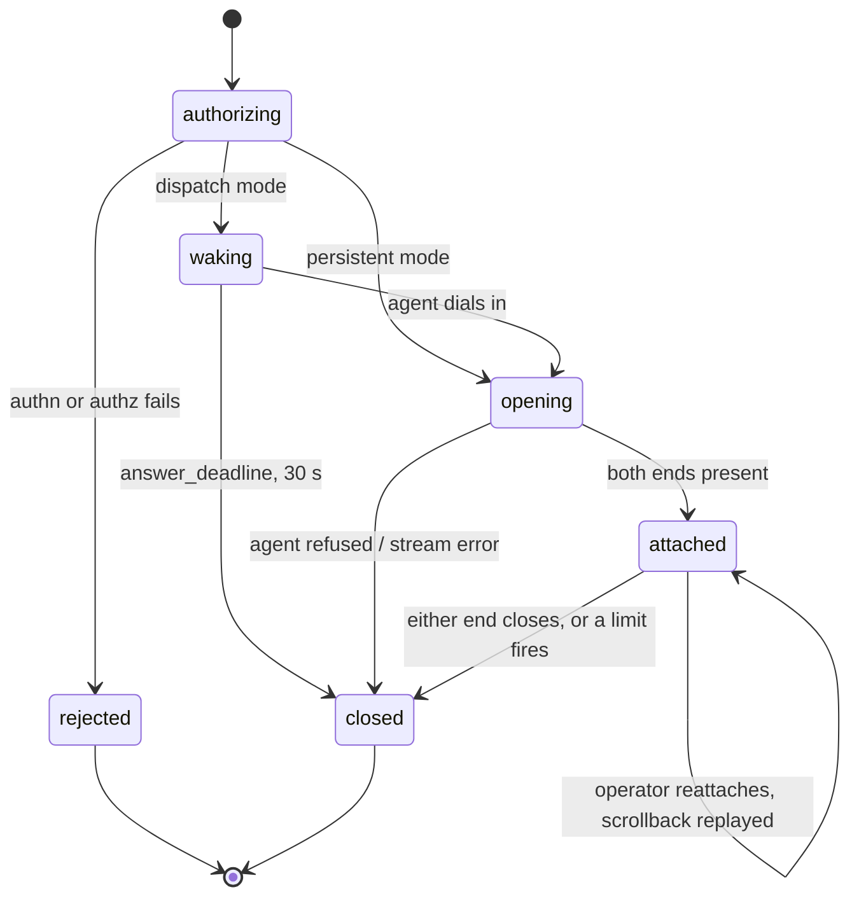

# Architecture

> Companion documents: [protocol](docs/protocol.md) for the bytes,
> [plugins](docs/plugins.md) for the interfaces, [threat model](docs/threat-model.md)
> for what happens when a piece of this is hostile.

## 1. Scope

**In scope.** Give an operator an interactive shell — and file transfer and port
forwarding — on a device that cannot be dialed from the network the operator is on,
with central authorisation, central revocation, and a replayable recording of the session.

**Out of scope, deliberately.**

- *Device management.* Oarlock opens shells. It does not do enrollment, inventory, OTA,
  telemetry or configuration. It expects to be embedded in something that does.
- *Identity.* There is no user database. `Authenticator` and `Authorizer` are interfaces;
  bring Casdoor, Okta, an OIDC provider, or a YAML file.
- *An L3 overlay.* A session is a pipe to one process on one device, scoped to one ticket.
  If you want the fleet on a network, you want OpenZiti or Tailscale, not this.
- *Running the agent for you.* Supervision, restart, and reaching the network are the
  host platform's job — an Android `Service`, a systemd unit, a container's entrypoint.

### The one assumption that shapes everything

**The device can make an outbound TLS connection on 443, and nothing else.** No inbound
port, no stable address, no VPN, and — on the platforms this was designed for — no ability
to install and supervise a separate `sshd` binary. Every decision below follows from that
sentence.

## 2. Components

```
┌────────────────────────── oarlockd (one binary) ─────────────────────────┐
│                                                                          │
│  sshsrv        gliderlabs/ssh front door        :2222                    │
│    ├─ auth          Authenticator  ──▶ plugin                            │
│    ├─ authz         Authorizer     ──▶ plugin  (+ Watch for revocation)  │
│    └─ channels      session, exec, sftp subsystem, direct-tcpip          │
│                                                                          │
│  httpsrv       HTTPS                            :8443                    │
│    ├─ /ws/control   held channel, framed, device key   (persistent only) │
│    ├─ /ws/session   one per session, framed, ticket    (both modes)      │
│    ├─ /ws/attach    browser leg,  framed, ticket                         │
│    ├─ /api/…        sessions, devices, recordings, health                │
│    └─ /ui           embedded xterm.js + asciinema-player (optional)      │
│                                                                          │
│  hub           device → control channel · pair() · pending invitations   │
│  pump          byte pump · coalesce · per-profile flow control           │
│  record        Recorder plugin  ──▶ asciicast v2                         │
│  store         SessionStore plugin · Ownership plugin                    │
│  dispatch      Dispatcher plugin (dispatch mode only)                    │
│  audit         AuditSink plugin                                          │
└──────────────────────────────────────────────────────────────────────────┘

┌────────────────────── oarlock-agent (reference) ─────────────────────────┐
│  dialer        outbound WSS, backoff, HELLO / challenge–response         │
│  session       one goroutine per stream                                  │
│    ├─ shell    forkpty → the platform's shell                            │
│    ├─ exec     allow-listed argv, no shell interpretation                │
│    ├─ file     read / write under a configured root                      │
│    ├─ tcp      dial 127.0.0.1:port from the allow-list                   │
│    └─ sshpass  dial the device-local sshd  (mode A only)                 │
└──────────────────────────────────────────────────────────────────────────┘
```

One binary for the gateway, one for the reference agent. The gateway is stateless with
respect to *sessions it does not hold* — everything durable lives behind `SessionStore`
and `Recorder`, which is what makes a restart survivable and multi-node possible (§10).

## 3. Reachability modes

### 3.1 `persistent` — the agent holds a connection open

```
agent ──── WSS control channel, held open ────▶ oarlockd
                                                 hub: "treadmill-4821" → conn#7

new session:  gateway ──DIAL{ticket, url}──▶ agent      (down the control channel)
              agent   ──WSS + OPEN{ticket}──▶ gateway   (a fresh connection)
```

The agent connects once at boot and keeps the channel alive with PING every 30 s. The hub
holds `device_id → control channel`. Opening a session means sending `DIAL` and waiting for
the agent to come back on a new connection.

**The control channel carries no session traffic.** It is the doorbell and nothing else,
which is what makes this mode and `dispatch` converge: in both, a session is its own
connection authenticated by a single-use ticket, and the only difference is how the
invitation reached the agent (ADR-024, § 3.3).

The cost is one TLS handshake per session. Against a warm channel, with resumption, for
sessions the design assumes are rare and short, that buys away the stream id, the credit
accounting, the head-of-line problem, and a whole second path through the pump.

- **Cost:** one idle socket and ~16 KiB of buffers per device, on the gateway, forever.
  At 10 000 devices that is real but unremarkable for a Go process; at 500 000 it is a
  fleet-sized stateful service and you want `dispatch`.
- **Latency:** one round trip to first byte.
- **Failure mode:** the gateway restarting drops every agent at once, and they all
  reconnect together. The agent's backoff is therefore jittered
  (`base 1 s, ×1.6, cap 60 s, ±25 % jitter`) — without jitter, a rolling restart of two
  replicas is a self-inflicted thundering herd.

### 3.1.1 A held channel wins, whatever the mode says

The mode describes how to reach a device that is **not** connected. A device holding a
control channel right now is reachable through it, so that is what the gateway uses —
whatever the registry says its mode is.

This was not the original behaviour, and the original behaviour was wrong in a way a first
deployment hits immediately. `android` resolves to `dispatch` because the platform
*resists* a held connection, not because it forbids one; an agent on a desk, or a
foreground service, or a device on mains power holds one perfectly well. Branching on the
mode alone meant the gateway refused the session with `no_wake_method` — "no wake-up method
is configured for this device" — while holding that very device's control channel. It was
declining to use a connection it already had, because a doorbell it did not need was not
configured.

The preference is not a commitment. If the channel dies between the check and the send, a
`dispatch` device falls back to its doorbell; a `persistent` device has none, so that is
the device being gone. And where the channel does apply it is strictly better: no doorbell
delivery latency and no external dependency.

### 3.2 `dispatch` — the gateway rings a doorbell

```
oarlockd ── Dispatcher.Wake(device, ticket) ──▶ [ MQTT | webhook | exec ]
                                                        │
agent ──── WSS + one-time ticket ─────────────▶ oarlockd
```

If you already run an always-on channel to every device — an MQTT broker, a push service,
a polling loop — you already have the expensive part, and the tunnel can be dialed on
demand. `Dispatcher.Wake` hands the transport a device id and an opaque ticket; the agent
dials in and spends it.

- **Cost:** nothing at rest. This is strictly cheaper than `persistent` when shells are
  rare, which for most fleets they are.
- **Latency:** doorbell delivery + a fresh TLS handshake. Budget 30 s before giving up
  (`dispatch.answer_deadline`), because a sleeping radio is slow, not broken.
- **Failure mode:** the doorbell is now a dependency of the shell feature. When MQTT is
  down, sessions cannot open — and the operator must be told *that*, not "device offline".

### 3.3 What the modes share, which is almost everything

Both modes end in the same place: the agent dials a session connection and presents a
single-use ticket. `hub.pair()` joins the two ends, `pump()` moves bytes, the recorder tees.
The mode decides only **how the invitation is delivered** — a `DIAL` frame down a held
channel, or a `Dispatcher` over MQTT, a webhook or an exec — and both deliver the *same*
`Invitation` payload, so downstream of arrival there is one code path.

The mode is a property of the *device*, not the gateway, and it defaults from
`Device.Platform`: `android` resolves to `dispatch` because the platform resists held
connections, `linux` and `container` resolve to `persistent`. One gateway serves both,
because a fleet mid-migration is the normal case, not an edge one.

## 4. Termination modes

### 4.1 Mode C — gateway-terminated (default)

```
ssh client ──SSH──▶ oarlockd ──frames──▶ agent ──▶ PTY
                       └─ recorder (plaintext)
browser ────WSS───▶ oarlockd ──frames──▶ agent ──▶ PTY
```

The gateway runs a real SSH server. It authenticates the operator, authorises them against
the target device, allocates the session, and bridges. The device runs no `sshd`, holds no
host key, and opens no port.

The browser path is the same session reached over a WebSocket instead of SSH, which is the
point: a browser cannot speak SSH, so *something* server-side has to be the SSH endpoint.
Mode C makes that thing the gateway, once, instead of a per-session SSH client process.

**Cost:** the gateway is fully trusted. It reads every keystroke and can inject its own.
[docs/threat-model.md § Gateway compromise](docs/threat-model.md#4-gateway-compromise-is-total)
says so plainly rather than pretending otherwise.

### 4.2 Mode A — passthrough (opt-in per device)

```
ssh client ──SSH────────────tunnel, opaque────────────▶ sshd on 127.0.0.1
                       (gateway cannot read a byte)
```

The gateway becomes a blind relay: the operator's SSH connection is tunneled to a `sshd`
the device already runs, and the SSH protocol terminates at both ends. `scp`, `sftp`,
`ssh -L`, agent forwarding and everything else the protocol offers arrive free.

What you give up is the reason mode C exists:

| | Mode C | Mode A |
|---|---|---|
| Session recording | asciicast, always | **impossible** — ciphertext |
| Per-command audit | keystrokes are visible | connection-level only |
| Failure diagnosis | six distinct states (§11) | "connection closed" |
| Device key material | none | a host key per device, and a CA to sign them |
| Operator authorisation | central, revocable mid-session | central *and* `authorized_keys` on the device |
| Browser terminal | native | needs a server-side SSH client anyway |
| Device-side listener | none | a loopback socket |
| `scp` / `sftp` / `-L` | gateway implements them | free with the protocol |

Guard rails, because an unrecorded session must never be an accident. All four are
enforced in `internal/sshsrv/passthrough.go`, and an operator reaches this mode with
`ssh -s sshpass <device>@gateway` — usually as a `ProxyCommand`, so the inner `ssh`
terminates at the device:

1. `devices[].allow_passthrough` must be `true` for that specific device.
2. Policy `allow_unrecorded` must be `true` gateway-wide. The gateway-wide key is checked
   *first*, so a deployment that has not opted in answers identically for every device and
   the refusal cannot be used to discover which devices carry the flag.
3. The session row is written with `recording_state: not_recorded` — an unrecorded session
   is a queryable fact, not a missing file.
4. The operator sees a banner naming the mode before the first prompt, **and again as
   the session closes**. Nobody should discover which mode they were in from the
   absence of a recording six weeks later — and a disclosure carried by a single
   early message is one deleted packet away from never having been said. Terrapin
   (CVE-2023-48795) lets an attacker who can modify traffic delete a bounded prefix
   right after the channel opens; strict key exchange removes that primitive, and
   saying it twice removes the dependency on strict key exchange having worked. The
   one message inside that window carries progress text and no security claim.

**When mode A is the right answer:** an operator who needs `rsync` at speed on a device
that genuinely runs `sshd`, in a jurisdiction or contract where the gateway operator must
not be able to read the session. Both are real. Neither is the common case.

### 4.3 Why not only mode A

Mode A cannot serve a browser, and a browser is where most sessions start. Serving one
means terminating SSH in a server-side client — in the clear, exactly where mode C already
is. Mode A therefore does not remove the plaintext hop; it adds a fleet-wide SSH PKI
*and keeps* the plaintext hop for the primary interface. End-to-end survives only for
operators on a CLI.

Mode C also does not foreclose mode A: the `tcp` profile forwards a device-local port, so
mode A is "run `sshd` on loopback, forward 22" on an architecture that already exists.
Built the other way round, the PKI and key-distribution machinery are built *and* mode C
still has to be built for the browser.

## 5. Opening a session

### 5.1 `persistent` mode, mode C, from a CLI

```mermaid
sequenceDiagram
    autonumber
    participant O as ssh client
    participant G as oarlockd
    participant P as Authorizer
    participant A as agent
    Note over A,G: WSS held open since boot; hub knows treadmill-4821
    O->>G: SSH transport + publickey auth
    G->>P: Authenticate(principal)
    G->>P: Authorize(principal, treadmill-4821, shell)
    P-->>G: allow
    G->>G: SessionStore.Create → sess_01J8Z…
    G->>A: DIAL{session, ticket, url, profile shell, pty 132x38}
    A->>G: WSS connect + OPEN{ticket}
    A->>A: forkpty
    A-->>G: READY{stream 3}
    G->>G: Recorder.Open → asciicast header
    G-->>O: banner + first prompt
    loop while attached
        O->>G: DATA (keystrokes)
        G->>A: DATA
        A-->>G: DATA (output, coalesced ≤25 ms)
        G-->>O: DATA
        G->>G: tee to recorder
    end
```

### 5.2 `dispatch` mode

```mermaid
sequenceDiagram
    autonumber
    participant O as operator
    participant G as oarlockd
    participant D as Dispatcher
    participant A as agent
    O->>G: connect + authenticate + authorize
    G->>G: mint device ticket (32 random bytes, TTL 60 s, single use)
    G->>D: Wake(treadmill-4821, ticket)
    D-->>A: doorbell
    Note over G,O: operator waits — this is a distinct wait from "authenticating"
    A->>G: WSS connect
    A->>G: OPEN{ticket, profile, pty, agent version}
    G->>G: ticket redeemed atomically; a second use is refused
    G->>G: pair(operator, agent)
    G-->>A: READY
    G-->>O: READY + banner
    Note over G,A: if no OPEN lands within answer_deadline (30 s):<br/>session closed, reason device_offline
```

The operator can arrive before the device does, always. The gateway holds the first
arrival and pairs on the second, and the UI must show *waking the agent* and *opening the
tunnel* as two separate lines — they are genuinely separate waits and either can be the
one that stalls.

### 5.3 Tickets

Only `dispatch` mode and the browser leg use tickets. Both are the same primitive:

- 32 bytes from `crypto/rand`, base64url, 43 characters.
- Single use. Redemption is an atomic compare-and-delete; the second attempt fails.
- TTL 60 s, and the TTL is a *deadline for connecting*, not a session lifetime.
- Carried in the `OPEN` frame body, **never in the URL** — a query string ends up in
  ingress logs, load-balancer logs, and browser history.
- Scoped to one device, one profile, and one principal. A ticket is not a credential for
  the gateway; it is a credential for exactly one pending session.

## 6. Session lifecycle



A dropped **operator** socket is not a close. The session stays `attached`, the ring
buffer keeps filling, and a reconnecting operator gets the scrollback replayed. Operators
lose wifi constantly; a shell that dies with it is a shell nobody trusts with a long
command.

`close_reason` is a closed set, and it is the single source of truth for what the UI says:

| reason | fired by |
|---|---|
| `operator_close` | operator disconnected cleanly, or the remote command exited |
| `device_close` | the PTY exited or the agent shut down |
| `idle_timeout` | no operator input for `limits.idle` |
| `max_duration` | `limits.max_duration` reached |
| `admin_kill` | `DELETE /api/sessions/{id}` |
| `revoked` | `Authorizer` withdrew the grant mid-session (§7) |
| `authz_unavailable` | `Authorizer` could not be reached for `authz.grace` consecutive re-checks (§7.1) |
| `recorder_failed` | the recording could not be written and the spool ran out (§8.1) |
| `device_offline` | agent never answered the doorbell |
| `transport_error` | either socket failed |
| `gateway_shutdown` | drain on SIGTERM |
| `policy_denied` | passthrough requested where policy forbids it |
| `policy_conflict` | two `record_input` rules disagree and one is non-overridable (§ 8.2) |

## 7. Authorisation and revocation

Authentication answers *who*; authorisation answers *may they, on this device, right now*.
The second question is asked more than once, which is the whole reason the gateway
terminates SSH.

```
open      Authorize(principal, device, action)         must return allow
every 30s Authorize(...) again                         deny → close(revoked)
always    Authorizer.Watch() → RevocationEvent         deny → close(revoked) in <1 s
on demand DELETE /api/sessions/{id}                    → close(admin_kill)
```

`Watch()` is optional — a backend that cannot stream just returns
`ErrUnsupported` and the re-check interval carries the load. The interval is the floor on
how stale a grant can be; `Watch` is the optimisation that makes it feel instant.

**The two are deliberately unequal, and building them the other way round is a trap.** A
system where `Watch` does the work and the interval is a backstop nobody exercises passes
every happy-path test and stops revoking the day a proxy starts timing out the stream. So
the re-check loop runs per session whether or not `Watch` is connected, and the test that
matters kills the stream *first* and then withdraws the grant.

A dropped stream is **not** a revocation. It means the gateway stopped hearing, not that
everybody's access was withdrawn — closing sessions on a disconnect would turn a network
blip into a fleet-wide kill, which is the same failure as conflating an outage with a
denial, arriving by a different door. The gateway reconnects with backoff and the stream's
state is observable, because a `Watch` that has been down for an hour is still *correct*
and somebody should still be able to see it.

### 7.1 Denied and could-not-ask are different facts

A re-check has three outcomes, not two, and conflating the last two is how an authorisation
service's bad minute becomes a fleet-wide outage during an incident.

| outcome | new sessions | live sessions |
|---|---|---|
| `Allow: true` | open | continue |
| `Allow: false` | refused, `not_authorized` | closed, `revoked` |
| **error** | **refused immediately** | **continue for `authz.grace` re-checks, then closed with `authz_unavailable`** |

`authz.grace` defaults to 3 consecutive failures — about 90 s at the default interval.
Inside that window the gateway keeps the last successful decision, counts the failures, and
emits an `authz.degraded` audit event on the first one. New sessions are refused from the
first failure, because opening a session on a stale decision is a different risk from
letting an operator finish a command on one.

Two things this buys that a bare fail-closed does not:

- **A transient outage does not kill work in progress.** Fail-closed with no tolerance means
  a thirty-second blip in the permissions API terminates every shell in the fleet — and it
  does so at the moment operators most need shells, because the same infrastructure event is
  usually why they are logged in.
- **The close reason is true.** `revoked` means a human decided to withdraw access.
  `authz_unavailable` means the gateway could not find out. Recording the first when the
  second happened poisons every audit query built on top of it.

`authz.grace: 0` restores strict fail-closed for anyone who wants it, and it is the right
setting where a session is more dangerous than an outage.

**Actions** are coarse on purpose: `shell`, `exec`, `file:read`, `file:write`, `tcp`,
`passthrough`, `replay`, `observe`, `sql:read`, and the three administrative ones —
`admin:devices`, `admin:permissions`, `admin:kill`. `exec` does not imply `shell` and
`passthrough` implies nothing — a grant that lets someone open an unrecorded session is not
a grant you want inherited.

**The administrative actions exist because authentication is not authorisation.** A bearer
token proves who is calling; it says nothing about whether they may rewrite the policy that
decides what they may do. Without a gate on the admin surface, every token holder is a
super-administrator and every other action here is advisory — anyone refused `shell` can
grant themselves `shell`, and under `authorizer.kind: sqlite` the store that answers the
question is the store the API writes to. So:

- `admin:devices` is checked against the device being changed, against its **stored**
  record, so that a tag-scoped grant or deny means what it says. `admin:kill` likewise. A
  fleet lead can hold `admin:devices` on `treadmill-*` and nothing else.
- `admin:permissions` is checked against the synthetic `gateway` device, because a
  permission is not device-scoped. Reading the policy needs it too: a list of who may reach
  what is a map of whom to go after.
- Ending your own session is not administration. `admin:kill` governs ending somebody
  else's, which is an intervention in their work.

**The break-glass.** The policy store is edited through an API the policy store authorises,
so an empty store has nobody who may write the first rule, and deleting the last
`admin:permissions` grant would lock the room. `authorizer.admins` in the config file names
principals allowed the administrative actions regardless of the backend's answer — logged at
boot and on every use. It grants `admin:*` and nothing else: a config administrator can
repair the policy, but to open a shell they must write themselves a grant, which is a
visible row and an audit line rather than a line in a file nobody re-reads. Because the
admin and session actions are disjoint sets, deny-beats-allow survives intact for
everything an operator actually does on a device.

`observe` is attaching read-only to a session somebody else is driving. It is deliberately
its own action and deliberately not implied by `shell`: watching a colleague work is a
different capability from working, it carries a consent dimension `shell` does not, and the
person being watched is told. An `observe` attachment sends no input, and the attachment
itself is an audited event.

**On `authorized_keys`.** The gateway's default `Authenticator` reads one, because it is
what everyone already has. It is fine for a handful of operators and wrong past that:
revocation means editing a file on every replica. The OIDC and SSH-certificate backends
exist for the same reason `Watch()` does.

## 8. Recording

`Recorder` is handed a session and returns a writer. The default implementation streams
[asciicast v2](https://docs.asciinema.org/manual/asciicast/v2/) — a JSON header line
followed by one `[time, "o", data]` line per output chunk, flushed as it goes.

Streaming rather than buffering is deliberate: **a gateway killed mid-session must still
leave a playable file.** An asciicast truncated at any line boundary plays perfectly up to
that point, which is a property worth more than a tidy footer.

**Detection is not prevention.** The chain and the signature mean an altered
recording can be *shown* to be altered. They do not stop the alteration — only storage
does, and only if it is configured to. Whatever the store can enforce is recorded in
the manifest and signed, so the guarantee is provenance rather than folklore. See
[plugins § 4.2](docs/plugins.md#42-storage-immutability-and-why-the-chain-is-not-enough).

### 8.1 What happens when the recorder fails

A session whose recording cannot be written does not stay open indefinitely — an audit
trail with silent holes is one nobody can rely on. But "the recorder returned an error"
must not mean "every session dies", because the recorder's backend is object storage over
a network, and object storage has bad minutes.

So there is a spool between the pump and the `Recorder`:

| | default | behaviour |
|---|---|---|
| `recorder.spool_bytes` | 64 MiB per session | writes land here first and drain to the backend |
| `recorder.flush_deadline` | 60 s | how long a backend may be failing before the session closes, measured from when it *started* failing — a store that briefly succeeds does not reset the clock indefinitely |
| on either limit | — | session closed with `recorder_failed`, and the unflushed remainder dumped to `recorder.spool_dir` as `<session>.offset-<n>.castfragment` |

**The fragment carries the byte offset it belongs at**, which is what makes recovery
mechanical rather than archaeological: append it to whatever reached the store at exactly
that position and the hash chain verifies again. Without the offset it is a pile of lines
somebody has to guess the position of.

**There is no buffer above the spool.** An earlier version put a `bufio.Writer` between the
encoder and the spool, and it was a bug: an event's bytes could be counted into the hash
chain while still sitting in that buffer, so when the spool gave up the manifest claimed one
more event than the file contained. Off by exactly one, only under failure.

Inside those bounds a failing backend is invisible to the operator and produces an
`recorder.degraded` audit event. Outside them the session closes and the partial recording
is still on disk, which is the point of streaming in the first place.

`Recorder: none` remains a deliberate, configured choice. A *failing* recorder is not, and
the difference is what the spool exists to preserve.

- Recorded: device→operator output, and operator→device input if
  `record_input: true` (off by default — see below).
- Not recorded: the `tcp` and `file` profiles (not terminal-shaped), and every mode A
  session (ciphertext).
- Finalised on close with the exit code and `close_reason` in a sidecar JSON.
- Replay is authorised separately (`replay` action). A recording is a *more* sensitive
  artefact than a live session: it is durable, greppable, and nobody is watching it being
  read.

**`record_input` is off by default, and this is not laziness.** Keystroke capture records
whatever an operator types into a `sudo` prompt or a `mysql -p` prompt. Terminal echo is
suppressed on the *device*, so the gateway sees the characters regardless of what the
screen shows. If you turn it on, your recordings are a credential store and must be
treated as one.

Output-only recording still shows most commands, because a line-mode shell echoes them. Be
precise about what it loses: **anything in raw mode** — `vi`, `less`, a TUI — leaves only the
rendered screen, not the keys that drove it, and anything typed with echo suppressed does not
appear at all. Output-only is a defensible default, not a complete record.

### 8.2 `record_input` is a policy, not a preference

Two compliance regimes point opposite ways on this single setting:

- **PCI DSS 4.0.1** expects privileged session recording that captures administrator
  keystrokes in a tamper-evident log.
- **GDPR and EU employment law** treat continuous keystroke logging as effectively
  prohibited, require a DPIA before systematic monitoring is deployed, and give works
  councils co-determination rights in several member states.

So it cannot be one global boolean. `record_input` resolves per session from a selector
policy, and the selector matches **both** sides of the session, because the two regimes
attach to different parties:

| regime attaches to | matched on | why |
|---|---|---|
| employment and privacy law | the **operator's** attributes — `Principal.Attrs`, groups | keystroke capture is monitoring of *that employee*, governed where they work |
| PCI and equivalent scope | the **device's** tags | the obligation follows the cardholder-data environment the device sits in |

```yaml
policy:
  record_input:
    default: false
    rules:
      - when: { device_tags: { pci_scope: "true" } }
        value: true
      - when: { principal_groups: ["eu-staff"] }
        value: false
        authority: employment-law   # marks this rule non-overridable
```

**Conflicts are refused, not silently resolved.** If a device requires capture and the
operator's jurisdiction forbids it, the session does not open — it is rejected with
`policy_conflict`, and the audit event names both rules. The alternative is a gateway that
quietly picks one regime to violate, and picks it differently depending on rule ordering.

Note what this deliberately does **not** introduce: any tenancy concept. Selectors match
attributes that already exist — principal attributes from the `Authenticator`, device tags
from the `DeviceRegistry` — which is the same mechanism the `rules` authorizer already uses.

## 9. Flow control, limits and profiles

### 9.1 Coalescing

Device→operator output is batched into windows of up to 25 ms. A `logcat` firehose is
thousands of tiny writes per second; one frame per write is a syscall storm on both ends
and a WebSocket header per byte. Coalescing is order-preserving and lossless, so it is
always on.

### 9.2 Throttling is per profile, and the shell must never drop

Line-oriented output can be dropped and announced: a log stream loses a line, a `THROTTLE`
frame says how many bytes went missing, and the reader is no worse off.

**A full-screen program cannot survive that.** A dropped chunk lands in the middle of an
escape sequence and leaves the terminal corrupt until something forces a full redraw —
`vi`, `tmux`, `htop` and anything `ncurses` render as garbage, and a "42 bytes dropped"
marker cannot repair it.

| profile | policy |
|---|---|
| `shell`, `sshpass` | **backpressure.** The gateway stops reading the device socket at the high-water mark and resumes at the low one. WebSocket flow control carries the stall to the agent, which blocks on its own PTY write. |
| `log`, `exec` | **coalesce and drop**, with a `THROTTLE` frame naming the byte count. |
| `file`, `tcp` | backpressure; dropping is meaningless for a byte-exact transfer. |

A device producing faster than the operator consumes then behaves exactly as it would on a
local terminal: it blocks. That is correct, not a stall to fix. The pod stays protected —
memory is bounded by the ring buffer and the socket buffers, and the hard ceilings are the
idle and max-duration timers, not the drop policy.

### 9.3 Limits

| limit | default | why |
|---|---|---|
| `limits.idle` | 5 min | no bytes in **either** direction — an abandoned root shell on a device in a gym |
| `limits.idle_input` | 60 min | no operator *input*, while output still flows. Catches a `tail -f` nobody is reading without killing work in progress. |
| `limits.max_duration` | 4 h | the ceiling on any session, however active |

**A window resize is not participation.** It counts as activity for `limits.idle` but
not as input for `limits.idle_input`: dragging a browser edge is not the operator
working, and treating it as such would keep an abandoned session alive on reflow
alone. **Both ends are told why** — a `CLOSE` frame carrying the reason goes to the
operator and the device before the session is torn down, so an operator sees
"idle_timeout" rather than a connection that simply stopped.
| `limits.max_duration` | 4 h | nothing legitimate needs longer, and it bounds a forgotten session |
| `limits.rate` | 256 KiB/s sustained, 1 MiB burst | one `cat /dev/urandom` must not saturate the pod; the bucket absorbs a screen redraw |
| `limits.batch` | 64 KiB | ceiling on one coalesced `DATA` frame, so the batch size and the frame ceiling are not two unrelated numbers |
| `limits.scrollback` | 256 KiB ring | what a reattaching operator gets replayed |
| `limits.sessions_per_device` | 1 | two shells on one device is almost always a mistake; enforced by the store, not hoped for |
| `limits.sessions_per_principal` | 5 | bounds one compromised account |
| `limits.frame` | 1 MiB | protocol-wide ceiling for *any* frame. `DATA` never approaches it — `limits.batch` binds first — so it is a safety net, not a working limit. |

Every one is server-side. A client-side limit is a suggestion.

**How the three throughput numbers relate**, since choosing them independently is how a
spec ends up with a 1 MiB frame ceiling on a 256 KiB/s stream and no way to tell which
number is wrong:

```
coalesce window   25 ms      ─┐
limits.batch      64 KiB     ─┤ one DATA frame ≤ 64 KiB
limits.rate       256 KiB/s  ─┤ sustained, token bucket, 1 MiB burst
limits.frame      1 MiB      ─┘ protocol ceiling — control frames and safety only
```

A 25 ms window at the sustained rate holds ~6.5 KiB; `limits.batch` is set an order of
magnitude above that so a burst — a full-screen redraw, a `dmesg` dump — travels in one
frame rather than being chopped into ten. `limits.frame` sits above `limits.batch` so that
a frame at the ceiling is unambiguously a bug or an attack, never traffic.

### 9.4 Profiles

`OPEN` names a profile, and the profile is what the ticket is scoped to.

| profile | agent does | recorded |
|---|---|---|
| `shell` | `forkpty` → the platform shell | yes |
| `exec` | one allow-listed argv, no shell interpretation, exit code returned | yes |
| `log` | tail a named log source from the device's own allow-list | yes |
| `file` | read/write under a configured root | no |
| `tcp` | dial `127.0.0.1:port` from an allow-list | no |
| `sshpass` | dial the device-local `sshd` (mode A) | never |

`log` names a *source*, never a path, and the mapping lives on the device. That is what
makes "may read the agent log" a policy somebody can write across a fleet whose members
keep that log in different places — and what stops a compromised gateway turning the
profile into an arbitrary file read, which `file` deliberately can be within its root.

`exec` exists so that automation does not need a shell. Most of what calls a shell wants
one command, and an allow-listed argv is a far smaller thing to audit than
`sh -c "$anything"`.

Three properties, each a deliberate refusal:

- **No shell interpretation.** The argv goes to `execve`. No quoting to get wrong, no
  globbing, no `$(…)`, no `;`, no redirection.
- **The device holds the allow-list.** The gateway authorises the *action*; the device
  decides what may actually run on it. A gateway that could name arbitrary commands would
  make every device's capability a property of the network.
- **Exact argvs.** An entry matches element for element. The tempting alternative — an
  allow-list of *programs* with caller-supplied arguments — is where the shell problem
  returns in a new shape: `tail` with a chosen path reads any file, `find -exec` runs
  anything, `curl -o` writes anywhere, `git -c` runs a configured pager. Deciding which
  flags of which binary are safe is a per-binary research project and getting it wrong is
  silent. Parameterised commands are spelled out one per variant.

Two operator surfaces. `ssh device some command` runs it, with stderr on the SSH
extended-data channel — which is what `DATA_ERR` is in the frame vocabulary for — and the
exit status propagating. `POST /api/v1/devices/{id}/exec` runs the session on the gateway
itself and answers with stdout, stderr and a code, because there is no terminal to attach
to and a backend wanting one command should not have to speak the session protocol.

### The `file` profile

Confinement is delegated to `os.Root`, deliberately. Every hand-rolled version of this
check has the same bug list — `..` surviving a clean, an absolute path bypassing the join,
a symlink whose target is outside the root, and the time-of-check-to-time-of-use race where
the symlink is swapped between the check and the open. The last one cannot be fixed by
inspecting a string at all, which is why the string is not what is inspected: `os.Root`
resolves each component in the kernel, so check and use are the same syscall.

What the profile adds on top is what `os.Root` has no opinion about. Only regular files —
a directory read is nonsense, `/dev/zero` is an unbounded transfer, and a FIFO opened for
reading waits for a writer that may never come, so reads use `O_NONBLOCK` and refuse
anything that is not regular *after* the open rather than blocking before it. A ceiling on
each transfer. And an atomic commit: a write goes to a temporary in the same directory and
is renamed into place, because a half-written configuration file is worse than the old one.

Not recorded, and that is enforced rather than documented: an asciicast of a binary
transfer is unwatchable, and a second copy of every transferred byte in the recording store
has its own retention and its own disclosure problem. The session row still says
`not_recorded`, so it is a queryable fact rather than an absence.

`file:read` and `file:write` are separate actions, so a grant to pull logs is not a grant
to replace a config.

**A session that ends without an `EXIT` frame reports 255**, matching `ssh`'s own
convention for a session that failed rather than a command that ran. It used to report 0,
which meant a device refusing a command looked to any caller like a command that succeeded.

### 9.5 Port forwarding

`ssh -L 8080:localhost:3000 treadmill-4821@gw.example.org -N` reaches a web UI, a database
or an `adb` daemon on a machine that holds no listener. The operator's own `ssh` is the
client: there is nothing to install, and `scp`, `rsync` and everything else that rides an
SSH channel come along with it. The gateway handles `direct-tcpip` itself rather than
using the library's handler, which dials from the *gateway* — the whole point is that the
**device** dials, on its own loopback.

**The target is a port, never a host.** `-L 8080:localhost:3000` is honoured;
`-L 8080:10.0.0.5:3000` is refused with a sentence saying why. A device that dialled a
host the gateway named would be an open proxy into whatever network it sits on — and that
network is, by construction, the one nobody outside can reach, which is why the device is
behind Oarlock at all.

**The device holds the allow-list**, exactly as it does for `exec`. `forward_ports` in the
agent's config is what is actually reachable; an agent with none advertises no `tcp`
capability, so an upgraded gateway forwards nothing until a device opts in. List ports
deliberately: a socket bound to loopback is usually bound there *because* it has no
authentication of its own, so forwarding it hands out whatever it was protecting.

`tcp` is its own action. A grant to open a shell is not a grant to reach every listening
socket on the device.

A refusal is carried as an SSH channel-open failure with the reason attached, which
OpenSSH prints only under `ssh -v`; the gateway log always carries it, so "why did my
forward not open" has an answer on both sides.

**One connection is one session** — ADR-024 applied rather than worked around. Each
forwarded connection gets its own row, its own invitation and its own websocket, so a
forward is killable, revocable and auditable with the machinery a shell already has. It is
not free: a browser opens up to six connections for one page, each costing a handshake to
the device. ADR-024 accepted that cost for sessions that are "rare and short"; forwarded
connections are neither, and that is the honest price of not multiplexing.

**Forwards are capped separately** (`limits.tcp_conns_per_device`, default 16) and do not
count against `sessions_per_device`. Sharing that cap would mean the second image on a page
failing with "this device already has a session open", and a forward starving the shell
somebody needs in order to fix it. The one-interactive-session-per-device guarantee keeps
meaning what the session list says it means.

**Half-close is not represented.** TCP lets one side finish sending while the other keeps
going, and `direct-tcpip` carries that as EOF; Oarlock's frame vocabulary has no
half-close, so a peer's EOF ends the whole forward. That is right for HTTP, Postgres, Redis
and adb, and wrong for protocols that signal end-of-request by shutting down the write side
— mostly `nc` and HTTP/1.0. Written down rather than half-implemented: a forward that
silently truncates one direction is worse than one that documents what it does not do.

Not recorded, for the same reason `file` is not: a TLS handshake streamed into an asciicast
is unwatchable. The audit trail is who forwarded which port and when, never the bytes.

The session timers apply unchanged, and `limits.idle` is the one to look at: a forwarded
connection with no traffic in either direction for five minutes is closed. A browser simply
reopens one, which is the common case and invisible; a long-lived idle connection —
`adb connect`, an open database handle — is not, so raise `idle` if that is the use.

## 10. More than one gateway

Single node is the default and it is honest: one `oarlockd`, in-memory store, in-memory
ownership. It is also a single point of failure, so the scale path is designed even though
it is not the first milestone.

`persistent` mode pins a device's **control channel** to whichever replica holds it. That
used to imply forwarding an operator's session from replica B to replica A, and a design
decision about where the ring buffer lives on that path.

**ADR-024 and ADR-025 removed the problem rather than solving it.** Because a session is
its own connection, and because the invitation names a specific node, replica B can send
the operator's session invitation *through* A's control channel and have the agent dial
**B** directly. No inter-gateway relay, no session bytes crossing a replica boundary, and
no question about where the ring lives: it lives on the node the operator is attached to,
because that is the node the agent dialled.

What is still needed:

- **`Ownership`** (Redis) mapping `device_id → node_id` with a lease, so B knows which
  replica to ask for the favour of a `DIAL`.
- **A control-plane hop between replicas** carrying an invitation — one small JSON message,
  not a byte pipe. This is a much smaller thing than a forwarding proxy.

`dispatch` mode needs neither: the doorbell delivers the invitation directly and it already
names the node. That remains a real argument for `dispatch` at scale, alongside the
idle-socket cost.

**Draining.** On `SIGTERM` the gateway stops accepting new sessions, sends `ERROR` with
`gateway_shutdown` to attached operators, finalises every recording, releases its
ownership leases, and exits — bounded by `drain_timeout` (default 30 s). Agents reconnect
with jitter (§3.1). Recordings survive because they were streamed, not buffered.

## 11. Failure paths

The UI never infers why a session died. Each state is rendered from exactly one
condition, and the mapping is part of the contract — which means it has to live somewhere
a build can check, not in a table in a document. It lives in **`pkg/condition`**: the
closed set, with the operator-facing sentence and the next action for each entry.

Both surfaces read it. The SSH front door prints the sentence; the browser component
renders a screen per condition from a copy generated out of the same table, and CI fails
when the two diverge. A condition the gateway can emit is therefore a screen the browser
has, by construction.

**This table is the summary, not the source.** It was the source until E3.S4, and it
drifted: it listed nine conditions while the planning documents specified eleven screens,
and the epic's own acceptance criterion named a tenth (`authz_unavailable`) that was in
neither. Worse, three distinct conditions shared the wire code `device_offline` with the
distinguishing sentence in `ERROR`'s `message` — a field the protocol says is for humans
and is never parsed, so a browser could render one screen for all three or break the
contract to tell them apart. They now have their own codes.

| condition | detected | recorded as | what the operator is told |
|---|---|---|---|
| `device_not_connected` | hub lookup, before dispatch (`persistent`) | `rejected` | "This device isn't connected." |
| `device_unreachable` | `Dispatcher.Wake` reported the device is not reachable | `rejected` | "This device isn't reachable right now." |
| `device_offline` | `answer_deadline`, 30 s (`dispatch`) | `closed` / `device_offline` | "The agent didn't answer." |
| `doorbell_failed` | `Dispatcher.Wake` returned an error | `rejected` | "Can't reach the device right now" — *not* "device offline". A broken doorbell is our fault, and saying "offline" sends someone to look at hardware. |
| `no_wake_method` | dispatch-mode device, no `Dispatcher` configured | `rejected` | A deployment mistake, reported as ours. |
| `not_authorized` | `Authorizer` at open | `403`, no session row | "You don't have shell access to this device." |
| `revoked` | re-check or `Watch` | `closed` / `revoked` | "Your access was revoked." |
| `authz_unavailable` | `Authorizer` unreachable for `authz.grace` re-checks | `closed` / `authz_unavailable` | "We couldn't confirm your access… your access hasn't changed." Never a revocation: the two send somebody to different places. |
| `policy_denied` | policy, at open | `rejected` / `policy_denied` | "Unrecorded sessions aren't allowed here." |
| `recorder_failed` | the spool ran out (§ 8.1) | `closed` / `recorder_failed` | The session stopped rather than continue unrecorded. |
| `session_limit`, `already_attached` | the store, and the pump's operator port | `409`, or refused at attach | The device or the session already has somebody on it. |
| operator socket dropped | gateway; session untouched | stays `attached` | "Connection lost, reconnecting…" then scrollback (§ 5.3 of the protocol) — deliberately *not* a failure screen |
| `idle_timeout`, `max_duration` | gateway timers | `closed` | Why the slot was released, and that a new session is fine |
| `admin_kill` | `DELETE /api/sessions/{id}` | `closed` / `admin_kill` | "An administrator ended this session… not by a failure." |
| normal end | either end closes | `closed` / `operator_close` \| `device_close` | "Session ended" + recording link |

**Audience.** The wire's closed set also contains conditions no operator can act on — a
malformed frame, a version mismatch, a ticket used twice. Giving each its own screen would
be writing eight ways to say "this is a bug in the application you are using", so they are
marked `Integrator` and share one screen that says exactly that, with the code and the
correlation id shown small and labelled for support. The distinction is the point: an
operator-facing condition tells somebody what to do next, and an integrator-facing one
tells them it is not their fault.

**One thing § 11 promises that is not built yet.** The idle timer's screen explains why a
session closed, but the *countdown* before it closes — "closing in N seconds", a warning
rather than a surprise — needs a frame that carries it, and no frame does. The screen is
honest about what happened; the warning ahead of it is outstanding work, not a
misdescription of what exists.

## 12. Repository layout

What exists:

```
cmd/oarlockd/            the gateway daemon; app/ is the wiring, app/ui/ embeds the console
cmd/oarlock-agent/       the reference device agent, as a runnable binary
internal/config/         the configuration file, its defaults, and its validation
internal/safety/         the boot gate, called by the daemon before it serves
internal/sshsrv/         the SSH front door: auth, PTY, the operator's disclosure
internal/controlsrv/     /ws/control — the held channel
internal/sessionsrv/     /ws/session — one connection per session
internal/attachsrv/      /ws/attach — the browser leg, reattach, and observation
internal/apisrv/         /api/v1 — sessions, tickets, recordings
internal/hub/            control channels, pending invitations, pairing
internal/invite/         mint, deliver, and wait for an agent to dial back
internal/pump/           byte pump, coalescing, flow control, deadlines, observers
internal/ring/           the scrollback a reattaching operator gets replayed
internal/record/         asciicast v3 writer, hash chain, spool, signed manifest
internal/sessions/       the ledger, plus the live-session registry
internal/sessionrun/     the shared session sequence, so two surfaces cannot drift
internal/authz/          the three-outcome contract, the grace window, the re-check loop
internal/ticket/         mint and redeem
internal/auth/           authorized_keys and static tokens
agent/                   the agent library, for embedding on a device
pkg/frame/               the wire codec — public, so other agents can be written
pkg/plugin/              the interfaces — public, so plugins compile out of tree
pkg/plugin/plugintest/   the conformance suite every backend runs, and its own tests
pkg/condition/           the closed set of failure conditions, and what each one says
pkg/transport/           WebSocket and an in-memory pair for tests
plugins/authz/rules/     the default authorizer: a YAML rules file
plugins/dispatch/        the doorbells: exec and webhook
packages/terminal/       @oarlock/terminal — the embeddable browser terminal
packages/react/          @oarlock/react — thin wrappers over it
web/                     the admin console, built into the daemon's binary
tokens/                  the single source for every colour in the product
tests/                   the front end's unit, component and console suites
docs/                    these documents
```

Planned, and named here so the shape is legible before it exists:

```
plugins/                 oidc, sshca, mqtt, redis, s3, gcs, postgres
api/openapi/             OpenAPI 3.1, generated from the handlers
sdk/go/                  client library, separate module, own tags
sdk/ts/                  @oarlock/sdk alongside the packages above
sdk/python/              generated client under a thin ergonomic layer
```

## 13. Decisions

| | decision | because |
|---|---|---|
| OL-001 | The device dials out; nothing listens on it | The one assumption in §1. Everything else is downstream. |
| OL-002 | SSH terminates at the gateway by default | The only shape that gives a real client, a browser, and a recording at once. |
| OL-003 | Passthrough exists, opt-in, and is never silent | Some sessions must be opaque. None should be opaque by accident. |
| OL-004 | Both `persistent` and `dispatch`, persistent by default | Zero-dependency out of the box; the doorbell is what scales. Same pump behind both. |
| OL-005 | Binary frames, one type byte, no length field | No base64 tax on the hot path, and no length for a peer to lie about — the message boundary is the frame boundary, so the decoder never allocates on a claim. |
| OL-006 | Authorisation is re-checked mid-session, and streamable | Revocation that waits for the next login is not revocation. |
| OL-007 | asciicast v2, streamed | A killed gateway still leaves a playable file. |
| OL-008 | `shell` backpressures; `log` and `exec` drop | Dropping bytes from a full-screen program corrupts the terminal beyond repair. |
| OL-009 | Every integration point is an interface with a working default | `go run` must need nothing. Scale must not need a fork. |
| OL-010 | `record_input` defaults to off | Keystroke capture makes recordings a credential store. |
| OL-011 | Single node first, ownership map designed | Node-to-node forwarding beats sticky routing, but not on day one. |
| OL-012 | `pkg/frame` and `pkg/plugin` are the only public Go API | The Android agent is somebody else's binary. |
| OL-013 | The control API is the integration surface, and its OpenAPI is generated from the handlers | A spec written beside the code drifts from it, and a drifted spec is worse than none because people trust it. |
| OL-014 | Sessions are opened on behalf of a human; a service account holds no shell grant of its own | A recording attributed to `svc-crm` shows someone typing `rm -rf` with a robot's name on it. |
| OL-015 | The agent ships as a library first, a binary second | Android 10 forbids executing a binary from app storage, so on the target platform in-process is the only option. |
| OL-016 | An authorisation *error* is not a denial; live sessions get a grace window | Fail-closed with no tolerance turns someone else's bad minute into a fleet-wide kill, during the incident that put operators on the devices. |
| OL-017 | A bounded spool sits between the pump and the recorder | Keeps the audit guarantee while surviving object storage's bad minutes, and still leaves a playable partial file when it gives up. |
| OL-018 | Delegated authority is a signed assertion, never a header | A plain `On-Behalf-Of` lets any service token act as any human, which is privilege escalation in the one place the design claims attribution as its reason to exist. |
| OL-019 | Idle is measured on both directions, with a separate input-only ceiling | Counting operator input alone kills a twenty-minute firmware flash at minute five. |
| OL-020 | `batch`, `rate` and `frame` are chosen as one set | Chosen independently they end up orders of magnitude apart, and then nobody can tell which of the three is wrong. |
| OL-021 | Both reachability modes ship in M0 | The primary platform requires the doorbell. Building the other one first for three milestones tests the path Android resists. |
| OL-022 | `record_input` resolves from a selector policy over operator *and* device attributes; conflicts refuse the session | The two regimes attach to different parties, and a gateway that silently picks one to violate is worse than one that stops. |
| OL-023 | `observe` is its own action, and the observed operator is told | Watching someone work is a different capability from working, with a consent dimension that must not be inherited from `shell`. |
| OL-024 | **Oarlock does not multiplex.** A connection is one session or the control channel. | Found while building the codec: adopting a multiplexer needs a byte stream, which puts a length field back and hands back the allocation surface the framing removes; hand-rolling one means owning flow control and the head-of-line problem. Not multiplexing costs a TLS handshake per session — for sessions that are rare and short — and makes the two reachability modes one data path. |
| OL-025 | The invitation names a gateway **node**, not a load balancer | An agent dials the replica the operator is already waiting on, which removes the need to forward a session between replicas (§ 10). |
| OL-026 | Forwarded connections are capped separately from sessions, and never claim the device's slot | One `ssh -L` is as many TCP connections as the client opens — a browser page load is six. Sharing `sessions_per_device` would fail the second image on a page with "this device already has a session open", and let a forward starve the shell needed to fix it. Splitting the cap keeps "one interactive session per device" meaning what the session list says (§ 9.5). |
| OL-026 | Where a replay may start is tracked as bytes are written to the ring, not decided when they are read | A ring drops its oldest bytes, and the byte it drops may be the `ESC` that opened a sequence still in the buffer. From the middle of a stream, a parameter byte and a printable byte are the same byte, so a reader cannot tell `1;2` inside a CSI from the text "1;2" — the information only exists while the stream is being parsed in order. A minimal parser marks the positions between sequences on the way in; the replay starts at the oldest surviving mark and reports what it skipped. |
| OL-029 | The re-check interval is the revocation guarantee; `Watch` is only an optimisation | A stream can die quietly — a proxy timing out an SSE connection looks like nothing at all. A design where `Watch` carries the load passes every test that exercises it and stops revoking the day it breaks, silently. So the interval loop runs regardless, and a dropped stream reconnects rather than closing anything. |
| OL-027 | A watcher's read-only-ness is structural: the pump never reads their connection | A check is a line somebody can later move, and the thing being prevented is a second person typing into a shell they are only supposed to be reading. With no code path from a watcher's socket to the device, the guarantee survives a mistake about who they are. Their socket is still read — by the handler holding it — so that leaving is noticed promptly and attempted input is counted rather than vanishing. |
| OL-028 | An absent operator never blocks the device | Output drains into the ring at full speed while nobody is attached. The alternative is backpressure to a PTY, which stalls a background job because somebody's wifi dropped — and the ring is bounded, so the memory cost of draining is a fixed 256 KiB rather than an unbounded queue. |

## 14. Milestones

**M0 — the spike.** **Both** reachability modes, mode C, `shell` profile,
`authorized_keys` auth, in-memory store, no recording. `ssh dev-1@localhost -p 2222` reaches
a PTY over either mode. This is the proof that the pairing and the pump are right.

`dispatch` is in M0 rather than M3 because the primary target platform requires it. Android
actively resists a held connection — apps are bucketed into standby tiers, persistent
connections can be flagged as excessive, and a `dataSync` foreground service **cannot be
started from `BOOT_COMPLETED`**, which is exactly when a rebooted device needs to become
reachable. Building `persistent` first and reaching the doorbell three milestones later would
mean testing the mode Android fights and shipping the one it needs last.

What moves with it: ticket minting and redemption, the `Dispatcher` interface, and the `exec`
and `webhook` adapters — which need no infrastructure and make the mode testable on a laptop.
The **MQTT adapter stays in M3**; the mode was the urgent part, not the broker.

**M1 — recordable.** asciicast recorder, `SessionStore` with SQLite, close reasons, limits
and the per-profile flow control, `/api/sessions`. A session you can replay and account for.

**M2 — the browser.** `/ws/attach`, xterm.js, reattach with scrollback, the six failure
screens, asciinema-player for replay.

**M3 — pluggable.** OIDC and SSH-CA authenticators, webhook authorizer with `Watch` and the
grace window, the **MQTT** dispatcher adapter, S3/GCS recorder, Postgres store, device key
rotation.

**M4 — the rest of the protocol.** `exec`, `file`, `tcp` and `direct-tcpip` have landed
(§ 9.5), and mode A passthrough has landed on top of `tcp` as the `sshpass` profile,
reached with `ssh -s sshpass` and gated by the four guard rails in § 4.2. The `log`
profile has landed too, reached with `ssh -s log:<source>`, and the agent conformance
suite is in `pkg/agentconf` with a binary at `cmd/oarlock-conformance` (E5.S6, FR39, SC7).
What is left: the sftp subsystem — which FR10 does not require, so it is a convenience
rather than a gap.

**M5 — more than one.** `oarlockctl` has landed (E6.S4): list, inspect, kill, fetch, and
verify a recording against a key the operator holds rather than against this gateway's
opinion of its own file. Metrics have too (E6.S5) — golden signals plus every plugin's
latency and error rate, documented in [docs/metrics.md](docs/metrics.md) with a starter
alert set. What is left: Redis ownership, node-to-node forwarding, and the load test that
says how many idle agents one replica actually holds.

**M6 — integration.** OpenAPI generated in CI, the Go and TypeScript SDKs,
`@oarlock/terminal` and `@oarlock/react`, signed webhooks with a dead-letter list, and the
agent library extracted with a Kotlin binding. This is the milestone that decides whether
anyone else can use the project, so it is a milestone rather than a footnote — but it needs
M1–M4 to be true first, because an SDK over a protocol that is still moving is a promise
you have to break.
