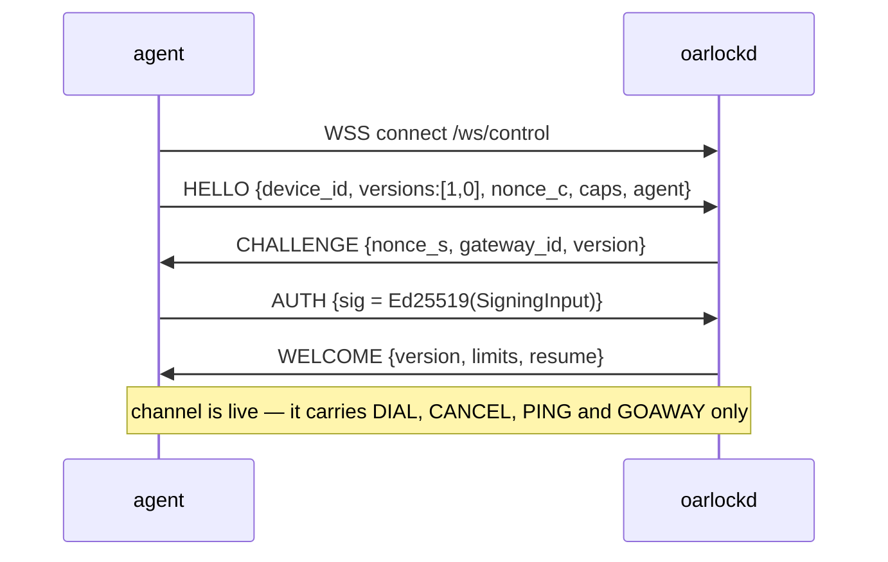

# Wire protocol — `v0`

The framed protocol between `oarlockd` and an agent. Also used on the browser leg
(`/ws/attach`), because one codec is cheaper to get right than two.

**Status: `v0`, unstable.** It will change without ceremony until a `v1` tag. Anything
implementing this today should pin a commit.

**Public codec.** `pkg/frame` is the reference implementation and part of the public API.
A third-party agent — Android, Rust, embedded — needs this document and that package and
nothing else.

---

## 1. Transport

WebSocket over TLS, `Sec-WebSocket-Protocol: oarlock.v0`.

- **Every message is a binary WebSocket frame.** No text frames. A text frame is a
  protocol error and closes the connection.
- One protocol frame per WebSocket message. The message boundary *is* the frame boundary,
  so there is no length prefix to get wrong — and no length field an attacker can lie about
  to force an allocation.
- WebSocket ping/pong at the transport layer is not used for liveness. Some proxies answer
  it themselves, which makes it a test of the proxy rather than of the peer. Oarlock's own
  `PING`/`PONG` frames (§4.5) are end-to-end.
- Idle-timeout survival is the `PING` frame's second job: ingress controllers that close
  quiet connections after 60 s are the common case, so the default interval is 30 s.

### 1.1 Endpoints

| path | who dials | authenticated by |
|---|---|---|
| `/ws/control` | the agent, `persistent` mode | the device key, challenge–response (§ 3.1) |
| `/ws/session` | the agent, once per session, in both modes | a single-use ticket in `OPEN` (§ 3.2) |
| `/ws/attach` | the browser | ticket, in the `OPEN` frame body |

### 1.2 Tickets never travel in a URL

A ticket is carried in an `OPEN` frame body. Not a query string, not a path segment.
Query strings land in ingress access logs, load-balancer logs, APM traces and browser
history, and a single-use ticket in a log file is still a ticket until it is redeemed.

`Sec-WebSocket-Protocol` is also not a credential channel: it is logged by roughly
everything and capped at a length that will not hold one anyway.

## 2. Frame layout

```
  ┌────────┬──────────────────────────────────────┐
  │ byte 0 │ bytes 1 … n                          │
  │  type  │ payload                              │
  └────────┴──────────────────────────────────────┘
```

One byte. That is the entire header, on every connection, in both reachability
modes.

**There is no stream id, because Oarlock does not multiplex.** A connection is
exactly one of two things:

| connection | carries | who dials it | authenticated by |
|---|---|---|---|
| **session connection** | `0x0x` frames — one session's traffic | the agent, or the browser | a single-use ticket in `OPEN` |
| **control channel** | `0x1x` frames — and no session traffic at all | the agent, in `persistent` mode | the device key (§ 3.1) |

The control channel is the doorbell and nothing more: it exists so the gateway can
say *dial me for session X*. Session bytes never cross it.

**Why not multiplex** (ADR-024). Multiplexing was specified — a four-byte stream id
and a `WINDOW` credit frame — and then removed, for a reason worth recording so it
is not reintroduced by someone who thinks it was an oversight:

- **Adopting a library** (`smux`, `yamux`) means handing it a byte stream. Wrapping
  a WebSocket as one puts length-prefixed framing back inside the connection, and a
  length field is precisely what a hostile peer lies about to make a decoder
  allocate. That is the surface this format exists to remove.
- **Hand-rolling it** means owning a flow-control protocol, plus the head-of-line
  problem that makes per-stream credit necessary in the first place: refusing to
  read a connection in order to slow one stalled session would stall every other
  session sharing it.
- **Not multiplexing** costs one TLS handshake per session, against a control
  channel that is already warm, for sessions the whole design assumes are rare and
  short. In exchange the stream id goes, `WINDOW` goes, the credit accounting goes,
  and the two reachability modes converge on one data path — in both, a session is
  its own connection, and the only difference is how the agent learns to dial.

**Payload encoding.** `DATA`, `DATA_ERR`, `PING` and `PONG` payloads are raw bytes —
terminal traffic is binary and a JSON envelope would put base64 on the one path
where volume and latency matter. Every other frame carries compact JSON: they happen
a handful of times per session and readable beats compact when you are debugging a
handshake at 2 a.m.

**Limits.** A frame larger than `limits.frame` (default 1 MiB) closes the connection
with `frame_too_large`. `DATA` frames are bounded well below that by `limits.batch`
(64 KiB), the ceiling on one coalesced batch — so a `DATA` frame anywhere near the
protocol ceiling is a bug or an attack, never traffic. The three throughput numbers
are chosen as one set; see
[ARCHITECTURE § 9.3](../ARCHITECTURE.md#93-limits).

**Unknown types.** Unknown session-scoped types are ignored *on that connection*
with a logged counter; unknown connection-scoped types close it. Forward
compatibility for what can be skipped, strictness for what cannot. A frame from the
wrong family — a session frame arriving up a control channel, a `DIAL` arriving down
a session connection — closes the connection too: the peer is confused about which
connection it is holding, and there is no sane per-frame recovery from that.

## 3. Handshakes

Three, and they divide along the two connection kinds.

### 3.1 Control channel — device key, challenge–response

A `persistent`-mode agent holds one control channel, so it needs a long-lived
identity. It gets an Ed25519 key pair generated on the device at first boot; the
public half is registered out of band by whatever does enrollment. **The private key
never leaves the device and is never sent** — a bearer token would be replayable by
anything that read a log.



The signed bytes are **length-prefixed and domain-separated**, not concatenated. There
are two versions, and the version *is* the domain separator:

```
v1 (channel-bound)                      v0 (unbound)
"oarlock-control-v1" 0x00               "oarlock-control-v0" 0x00
  u16(len) nonce_s   u16(len) nonce_c     u16(len) nonce_s   u16(len) nonce_c
  u16(len) device_id u16(len) gateway_id  u16(len) device_id u16(len) gateway_id
  u16(len) channel_binding
```

`channel_binding` is 32 bytes of RFC 5705 exported keying material, label
`EXPORTER-oarlock-control-v1`, taken from the TLS connection the handshake is running on.
**It never appears on the wire** — both sides compute it independently and only mix it into
what is signed.

Making the version the domain separator rather than a field inside the input is what makes
cross-version replay impossible by construction: a v0 signature cannot verify as a v1 one
whatever else matches.

An earlier draft of this document described plain concatenation, and that was a
vulnerability rather than a simplification: device `ab` with gateway `c` produces
the same bytes as device `a` with gateway `bc`, so a peer that controls one field
can shift the boundary and obtain a signature that validates against values nobody
agreed to. Length prefixes make the encoding injective. The domain string means a
device key's signature can never be valid in some other protocol that happens to
hash similar bytes.

- Both nonces are 32 random bytes, base64url. Both sides contribute, so neither can
  pin the signed value.
- **A failed handshake always reports `auth_failed`**, whether the device is
  unknown, the signature is wrong, or the key was retired — and the exchange does
  not short-circuit, so an unknown device still receives a `CHALLENGE`. The
  protocol has a `device_unknown` code; sending it to an unauthenticated peer would
  hand it an enumeration oracle for the fleet. The specific reason is logged.
- Every registered key is tried, which is what makes rotation work: publish the new
  key alongside the old, let devices roll over, then retire the old one.
- The gateway id is in the signed blob so a signature captured by one gateway cannot
  be replayed to another.
- **Channel binding (v1) is what stops a relay.** A TLS-terminating middlebox has two
  TLS sessions and therefore exports two different keying materials: the device signs over
  one and the gateway verifies over the other, so the signature does not verify. The
  middlebox does not have to modify a single frame for this to catch it.

  Certificate pinning was the stopgap and covers less than it looks: it only stops a
  middlebox that has to present a certificate the device would *reject*. An inspection
  appliance whose CA is in the device's trust store passes pinning and then holds the
  device's authenticated channel.

- **The version is chosen by the gateway, so downgrade is a policy question on both
  sides.** `CHALLENGE` carries the chosen version precisely because the agent has to know
  it before it signs — an agent that learned it from `WELCOME` would already have signed
  the wrong thing. The agent checks it against what it offered.

  Beyond that, nothing cryptographic can stop a downgrade: a v0 handshake genuinely has
  nothing to bind with, so refusing one is a decision rather than a verification. Both
  ends therefore carry an explicit `require_channel_binding`, and an agent that sets it
  does not offer v0 at all. **Both default to off**, because requiring binding means
  refusing to connect to a gateway that cannot provide one — and a fleet in the field that
  will not reconnect needs somebody to drive to it. Binding is used wherever both ends
  can; it is *required* only where somebody has said so. `internal/safety` refuses
  production without it on the gateway.

  Exporting also fails on a TLS 1.2 session resumed without extended master secret, where
  the exporter would not be tied to this handshake. Go refuses rather than returning
  something that looks bound and is not, and a gateway that requires binding reports that
  as a refusal rather than downgrading.
- The whole exchange has a 5 s budget from socket open. `AgentAuthenticator` may
  replace it entirely — mTLS moves the problem into the TLS layer and skips § 3.1.
- `WELCOME.resume` names sessions the gateway is still holding for this device. The
  agent dials back for each one, which is how a shell survives a device losing its
  radio.

### 3.2 Session connection — one-time ticket

Every session, in **both** reachability modes, is its own connection opened with a
ticket:

```
agent ──▶ WSS connect  /ws/session
agent ──▶ OPEN {ticket, device_id, profile, pty, agent}
gw    ──▶ READY {session_id, scrollback_len, recording, mode}   … or ERROR and close
```

The only difference between the modes is **how the agent learned to dial**:

| mode | the invitation arrives as |
|---|---|
| `persistent` | a `DIAL` frame down the control channel (§ 4.13) |
| `dispatch` | the identical payload, delivered by a `Dispatcher` over MQTT, a webhook, or an exec |

Both carry the same `Invitation`: session id, ticket, the URL of the **specific
gateway node** to dial, profile, pty, principal and an expiry. Downstream of arrival
there is one code path — which is the whole return on not multiplexing.

Redeeming a ticket is an atomic compare-and-delete; a replay finds nothing. A
retried dial must **fetch a new invitation, never resend a spent ticket.** An agent
that retries a spent ticket looks exactly like an attacker replaying one, and the
gateway cannot tell the difference, so it treats both as an attack.

### 3.3 Browser leg

```
browser ──▶ WSS connect  /ws/attach
browser ──▶ OPEN {ticket}
gw      ──▶ READY {session_id, scrollback_len} + DATA (scrollback replay)
```

Structurally identical to § 3.2 — a session connection authenticated by a ticket.
The attach ticket comes from `POST /api/v1/sessions`. It is single-use, so a
reconnecting browser asks for a fresh one, which is also the moment authorisation is
re-checked for free.

**A second connection for a live session is a reattach, not a new session.** If the
session named by the ticket is already running on this node, the gateway does not look
for a device — the device is already paired and pumping. It hands the connection to the
running session instead, and `READY` is followed immediately by the scrollback:

```
browser ──▶ WSS connect  /ws/attach
browser ──▶ OPEN {ticket}          ← a *fresh* ticket; the last one was spent
gw      ──▶ READY {session_id, scrollback_len: 12043, recording, mode}
gw      ──▶ DATA  (the scrollback, then the live stream)
```

`scrollback_len` is exactly what follows, so a browser can say "replaying 12 KiB" rather
than looking frozen. The greeting and the replay are written under the same lock as live
output, so a `DATA` frame produced a microsecond after the reattach cannot overtake the
scrollback and assemble the screen in the wrong order.

Two refusals are worth telling apart. A session that already has an operator answers
`session_limit`: two operators writing into one shell would interleave their keystrokes,
and watching one is a different feature. A session that cannot be reattached to at all —
every SSH session — answers `protocol_error`, because a second `ssh` invocation is a new
session and there is nothing to come back to.

**Either end may arrive first, and the gateway waits.** This is the one way the browser
leg genuinely differs from § 3.2, and it is not a detail: over SSH a single goroutine
invites the device and then blocks, so the device has always arrived by the time
anything looks for it. `POST /api/v1/sessions` instead returns as soon as the invitation
has been *delivered*, and the browser then connects on a separate request — routinely
faster than a sleeping device can wake, dial `/ws/session`, and present its ticket. So
`/ws/attach` blocks until the device's connection is parked, bounded by the same answer
deadline the invitation carries; only reaching that deadline is `device_offline`. A
gateway that instead refused whenever the device had not arrived *yet* would report
`device_offline` for perfectly healthy sessions, intermittently, decided by which of two
round trips won.

## 4. Frame reference

Twenty types. `0x0x` travel on a session connection; `0x1x` travel on a control
channel. Only `DATA` is hot — everything else happens a handful of times per session.

### 4.1 `0x01 DATA` — both directions

Raw bytes. The stream. Device→operator output is coalesced into ≤25 ms batches; operator
input is forwarded immediately, because a human is waiting on the echo.

### 4.2 `0x02 DATA_ERR` — device → gateway

Raw bytes on the error channel. Only the `exec` profile uses it: a PTY merges stderr into
the terminal by definition, but `exec` needs the separation to map onto SSH extended data
(`SSH_EXTENDED_DATA_STDERR`) and to give automation a clean stdout.

### 4.3 `0x03 OPEN` — agent or browser → gateway

First frame on a session connection, within 5 s of connect or the socket closes.

```json
{ "ticket": "hK3…43 chars", "device_id": "treadmill-4821",
  "profile": "shell", "pty": {"cols": 132, "rows": 38, "term": "xterm-256color"},
  "agent": {"version": "0.1.0", "platform": "android/34", "arch": "arm64"} }
```

`term` matters more than it looks: a PTY told `TERM=dumb` will not emit the escape
sequences a browser terminal is built to render, and a PTY told `xterm-256color` when the
client is not will emit sequences it cannot.

### 4.4 `0x04 READY` — gateway → both ends

```json
{ "session_id": "sess_01J8Z…", "scrollback_len": 4096,
  "recording": true, "mode": "gateway", "limits": {"rate": 262144} }
```

Watchers get their own `READY` with `read_only: true` and `watching` set to the operator
they are watching, so a client disables input rather than accepting keystrokes it will
silently drop.

Both ends are present and the pump is live. `recording` and `mode` are here so a client
can say which it is out loud — a session the gateway cannot read
(`mode: "passthrough"`, `recording: false`) must be visibly different from one it can.
They are sent on **every** attach, not only the first: the disclosure is a property of
the session, not a greeting.

`scrollback_len` is the number of bytes of replay that follow this frame — zero on a
first attach, and on a reattach the exact size of the snapshot the gateway is about to
send. It may be smaller than what the device produced while the operator was away, in
two ways the gateway does not hide: bytes the ring overwrote, and a leading fragment
skipped because replaying it would have started in the middle of an escape sequence
(§ 5.3).

### 4.5 `0x05 RESIZE` — operator → device

```json
{ "cols": 132, "rows": 38 }
```

Sent on every window change, coalesced to at most one per 100 ms — dragging a browser
window edge generates hundreds of events and the PTY only needs the last. A terminal that
lies about its size wraps every line wrong, and `vi` draws over itself.

### 4.6 `0x06 SIGNAL` — operator → device

```json
{ "signal": "INT" }
```

`INT`, `TERM`, `QUIT`, `HUP`, `KILL`, `USR1`, `USR2`, `WINCH`. Interactive `Ctrl-C` is
*not* this — it is the byte `0x03` inside `DATA`, interpreted by the device's line
discipline. `SIGNAL` exists for the SSH `signal` channel request and for a browser's
"stop" button on an `exec` with no PTY to interpret anything.

### 4.7 `0x07 EXIT` — device → gateway

```json
{ "code": 130, "signal": null }
```

The process exited. `exec` needs this to mean anything at all; `shell` reports it so the
recording sidecar and the session row can carry it.

### 4.8 `0x08 CLOSE` — either → either

```json
{ "reason": "operator_close" }
```

One of the `close_reason` values in
[ARCHITECTURE.md § 6](../ARCHITECTURE.md#6-session-lifecycle). A session connection
carries one session, so closing the session closes the connection.

### 4.9 `0x09 THROTTLE` — gateway → operator

```json
{ "dropped_bytes": 8192, "profile": "log" }
```

Sent only for profiles whose policy is drop (`log`, `exec`). **Never sent on a `shell`
stream**, because `shell` never drops — it backpressures. A `THROTTLE` on a shell stream
is a bug in the gateway, and a client that receives one should say so loudly rather than
render a marker into a terminal it will corrupt.

### 4.10 `0x0A ERROR` — gateway → either, **on either kind of connection**

```json
{ "code": "device_offline", "message": "agent did not answer in 30s", "retryable": false }
```

`code` is from the closed set in § 6 and is what the UI switches on. `message` is for
humans and logs and is never parsed.

**`ERROR` is valid on both connection kinds**, and it has to be. It is how a peer
explains why a connection is about to end, and a control-channel handshake that
fails has to be able to say why — otherwise a rejected agent learns only that the
socket closed, and cannot tell `version_unsupported` from `auth_failed`. `PING` and
`PONG` are exempt for the same reason (§ 4.12); every other type belongs to exactly
one connection kind.

### 4.11 `0x0B OBSERVERS` — gateway → operator and watchers

```json
{ "observers": [ { "principal": "sam@example.com", "since": "2026-08-21T10:14:02Z" } ] }
```

Who is watching this session read-only (FR13), sent whenever it changes. **The whole
list, never a delta**: a client that missed one frame would otherwise show a watcher who
has left, or miss one who arrived, and be wrong about the single fact this frame exists to
convey. An empty array means nobody and *is* sent — the indicator has to be able to go
away, and a session sitting at a prompt produces no output to carry the news.

`principal` is always present. Anonymous observation is not offered at any level: an
operator is entitled to know *who* is watching, not merely that somebody is.

The initial list also travels in `READY`, so an operator attaching to a session that is
already watched is told immediately rather than on the next change.

### 4.12 `0x10 HELLO` / `0x11 CHALLENGE` / `0x12 AUTH` / `0x13 WELCOME`

The control-channel handshake (§ 3.1).

```json
// HELLO
{ "device_id": "treadmill-4821", "versions": [0], "nonce_c": "…",
  "caps": ["shell", "exec", "log", "file", "tcp"],
  "agent": {"version": "0.1.0", "platform": "android/34"} }

// WELCOME
{ "version": 0, "gateway_id": "gw-a",
  "limits": {"frame": 1048576, "batch": 65536, "rate": 262144, "ping_interval": 30},
  "resume": {"sessions": [{"session_id": "sess_01J8Z…", "ticket": "…",
                           "url": "wss://gw-a.example.org/ws/session",
                           "profile": "shell"}]} }
```

`versions` is a list and `version` is the single one chosen — the gateway picks the
highest it shares with the agent. An agent offering no version the gateway knows is
closed with `version_unsupported`, which is a clearer failure than a mysterious
parse error six frames later.

`caps` is how a device says what it can actually do. An agent built without a PTY —
a locked-down build, a platform where `forkpty` is unavailable — omits `shell`, and
the gateway can then refuse the session at open time with a real reason instead of
after a round trip.

`resume` is the interesting field: if the agent reconnects while the gateway still
holds live sessions for it, `WELCOME` carries one invitation per session and the
agent dials back for each. A reconnecting agent keeps the operator's shell alive —
which matters, because a device on cellular loses its socket regularly and a shell
that dies with the radio is a shell nobody trusts with a long command.

### 4.13 `0x14 PING` / `0x15 PONG` — **on either kind of connection**

8-byte payload: a monotonic timestamp in microseconds, echoed verbatim. Drives the
latency readout in the UI, holds ingress idle timeouts off, and detects a peer that
is gone rather than quiet. Three missed pongs (`3 × 30 s`) closes the connection.

Like `ERROR`, these are valid on **both** connection kinds, and for the same
underlying reason: they are about the connection itself rather than about what it
carries. A control channel quiet for an hour still has to be known to be alive, and
so does a session where nobody is typing. Those three — `ERROR`, `PING`, `PONG` —
are the complete set of frames exempt from the one-kind rule.

### 4.14 `0x16 DIAL` — gateway → agent, control channel only

```json
{ "session_id": "sess_01J8Z…", "ticket": "hK3…",
  "url": "wss://gw-a.example.org/ws/session",
  "profile": "shell",
  "pty": {"cols": 132, "rows": 38, "term": "xterm-256color"},
  "exec": null, "principal": "phuc@example.com",
  "expires_at": "2026-08-21T09:15:02Z" }
```

For a `tcp` session the invitation carries `"tcp": {"port": 3000}` instead of `pty` or
`exec`. A **port, never a host**: the agent dials `127.0.0.1` and nothing else, so a
gateway cannot name a third party and turn the device into a proxy into the network it
sits on. The port is matched against the device's own allow-list on arrival, and refused
with `not_authorized` if it is not on it.

The target travels here rather than in a request frame, for the same reason `exec` and
`file` do: the ticket is scoped to a profile *and* to what was authorised, so one session
is one connection to one port and cannot be repointed after it opens.

*Dial me for this session.* This is the entire content of the control channel's
usefulness, and it is why the channel exists.

`url` names a **specific node**, not a load balancer. That is what lets a multi-node
deployment work without forwarding a session between replicas: the node the operator
is waiting on is the node named here, and the agent connects to it directly.

`principal` is passed so the agent can *log* who is on it. It is not an
authorisation input — the agent trusts the gateway completely and cannot check
anything itself.

The identical payload is what a `Dispatcher` delivers in `dispatch` mode. One shape,
two delivery paths, one handler.

### 4.15 `0x17 CANCEL` — gateway → agent, control channel only

```json
{ "session_id": "sess_01J8Z…", "reason": "operator_gave_up" }
```

That invitation is dead; do not dial. Without it a device that woke slowly would
dial for a session nobody is waiting on any more, spend a ticket, and be told to go
away — which looks like a bug from the device's side and costs a handshake for
nothing.

### 4.16 `0x18 GOAWAY` — either direction

```json
{ "reason": "gateway_shutdown", "reconnect_after_ms": 4200 }
```

`reconnect_after_ms` is jittered per agent by the gateway during a drain. Without
it, every agent in the fleet reconnects at the same instant and the replacement pod
dies of the herd — a self-inflicted outage, and the failure mode of `persistent`
mode that bites hardest at scale.

## 5. Behaviour the frames do not show

### 5.1 Coalescing

Device→operator `DATA` is batched into windows of up to 25 ms. `logcat` is thousands of
tiny writes per second; one frame each is a syscall storm plus a WebSocket header per byte.
Batching is order-preserving and lossless, so it is always on, in both modes, for every
profile. Operator→device input is never batched — a human is waiting for the echo, and
25 ms of added latency on every keystroke is felt.

### 5.2 Throttle policy is per profile

`shell` and `sshpass` backpressure. `log` and `exec` coalesce and drop, announcing it with
`THROTTLE`. `file` and `tcp` backpressure, because dropping bytes from a byte-exact
transfer is corruption.

The reason is that a dropped chunk lands in the middle of an escape sequence and leaves the
terminal broken until something forces a full redraw. `vi`, `tmux` and anything `ncurses`
render as garbage, and no marker can repair it. Full reasoning in
[ARCHITECTURE.md § 9.2](../ARCHITECTURE.md#92-throttling-is-per-profile-and-the-shell-must-never-drop).

### 5.3 Scrollback, and where a replay may start

A dropped operator socket is not a close. The session stays `attached`, the device keeps
producing into a bounded ring (`limits.scrollback`, 256 KiB), and a reconnecting operator
gets it replayed. Operators lose wifi constantly; a shell that dies with it is a shell
nobody trusts with a long command. What bounds an abandoned session is `limits.idle` — a
detached session receives no operator input — rather than a second timer with its own
edge cases.

The device is never blocked by an absent operator. Output drains into the ring at full
speed, because the alternative is backpressure all the way to a PTY, where a background
job stalls because somebody's wifi dropped.

**A ring cannot simply replay from its oldest byte.** The byte it dropped may have been
the `ESC` that opened a sequence whose remaining bytes are still in the buffer. Replaying
from there feeds a terminal the tail of a sequence it never saw the head of: `[38;5;196m`
arrives as text, or `2J` clears the screen, and the operator has no way to know it is an
artefact of reconnecting rather than what the device printed.

It cannot be fixed at replay time by guessing, because a parameter byte and a printable
byte are the same byte — from the middle of a stream there is no way to tell `1;2` inside
a CSI from the text "1;2". So the gateway tracks it on the way *in*: a minimal parser
marks the positions where the stream is between sequences, and a replay starts at the
oldest surviving mark. The bytes skipped to reach it are counted, so a client can show a
gap rather than a silence.

A device that opens a sequence and never closes it fills the ring with bytes that can
never be safely replayed. That is a hostile device rather than a shell, and the operator
gets the gap and nothing else.

### 5.4 Watching a session read-only

A second operator can attach to a live session as a watcher (FR13). Two properties hold
and both matter:

**Read-only is structural, not enforced.** The gateway never reads a watcher's connection
for forwarding — there is no code path from a watcher's socket to the device — so their
keystrokes cannot reach the shell even if the gateway is wrong about who they are. That is
a stronger guarantee than a check, because a check is a line somebody can later move. The
connection *is* read, by the handler holding it, for two other reasons: to notice promptly
when a watcher leaves, and so that input from a watcher is counted and logged rather than
vanishing.

**The operator is told, by name, for as long as it is true.** `OBSERVERS` (§ 4.11) goes to
the operator whenever the list changes, and the initial list is in `READY`. Whether an
operator may *refuse* observation is a separate product question and deliberately not
built: FR13 requires telling.

A watch ticket is a different kind from an attach ticket, minted by a different endpoint
(`POST /api/v1/sessions/{id}/observe`), and presenting one gets a read-only session rather
than the keyboard. Watchers are capped per session, because each one is a socket the output
path writes to.

### 5.5 Mode A passthrough

Passthrough is not a separate protocol. The operator's raw SSH bytes are `DATA` on a
stream opened with `profile: "sshpass"`, and the agent connects that stream to the
device-local `sshd` instead of to a PTY. The gateway does not parse, cannot record, and
never emits `RESIZE`, `SIGNAL` or `EXIT` on such a stream — SSH is carrying all of that
inside the ciphertext.

Note that `sshpass` *must* backpressure, and here it is not a policy choice: dropping
bytes out of an SSH stream breaks the MAC and kills the connection.

## 6. Error codes

| code | meaning | retryable |
|---|---|---|
| `ticket_invalid` | unknown, expired, or already redeemed | no |
| `ticket_scope` | ticket does not cover this device or profile | no |
| `auth_failed` | signature, key, or credential rejected | no |
| `device_unknown` | no such device id | no |
| `device_not_connected` | `persistent` mode, no control channel — the device is not there | yes |
| `device_offline` | the doorbell was delivered and nobody dialled in | yes |
| `device_unreachable` | the wake-up service says it cannot reach the device | yes |
| `no_wake_method` | a `dispatch` device with no dispatcher configured — a deployment fault, ours | no |
| `doorbell_failed` | `Dispatcher.Wake` errored — *our* fault, not the device's | yes |
| `not_authorized` | `Authorizer` said no | no |
| `revoked` | the grant was withdrawn mid-session | no |
| `authz_unavailable` | `Authorizer` could not be reached; the grace window expired | yes |
| `profile_unsupported` | agent did not advertise this capability | no |
| `policy_denied` | e.g. passthrough where `allow_unrecorded` is false | no |
| `policy_conflict` | two `record_input` rules disagree and one is non-overridable | no |
| `session_limit` | per-device, per-principal, or per-device forward cap reached | yes |
| `version_unsupported` | no shared protocol version | no |
| `frame_too_large` | exceeded `limits.frame` | no |
| `protocol_error` | malformed frame, wrong order, text frame | no |
| `recorder_failed` | recording could not start or continue | no |
| `gateway_shutdown` | draining | yes |
| `already_attached` | the session already has an operator | no |
| `no_wake_method` | see above | no |
| `wrong_node` | that session is live on a different gateway replica | yes |
| `internal` | anything else, with a correlation id in `message` | yes |

**These codes are the closed set, and `pkg/condition` is where it is written down** —
with the operator-facing sentence and next action for each one. Both surfaces render from
it and CI fails when the browser's generated copy drifts, so a code the gateway can emit
cannot be a screen a client does not have.

Three of these used to be one. `device_not_connected`, `device_offline` and
`device_unreachable` all travelled as `device_offline`, with the difference carried in
`message` — which this document says is for humans and is never parsed. A client could
therefore render one screen for three conditions that send somebody to three different
places, or break the contract to tell them apart. Splitting the codes was the smaller
change.

`recorder_failed` is fatal, but only after the spool gives up. If the recording cannot be
written at all the session does not open; a running session whose backend starts failing
keeps going until `recorder.spool_bytes` or `recorder.flush_deadline` is exhausted, and
then closes. **The alternative to closing is an unrecorded session that looks recorded**,
which is worse than no session at all — an audit trail with silent holes is one nobody can
rely on. The alternative to the spool is object storage's bad minute killing every session
in the fleet. `Recorder = none` is a deliberate, configured choice; a failing recorder is
not. See [ARCHITECTURE § 8.1](../ARCHITECTURE.md#81-what-happens-when-the-recorder-fails).

`authz_unavailable` exists for the same reason: it is the close reason for *could not ask*,
and it is deliberately not `revoked`, which means a human decided. See
[ARCHITECTURE § 7.1](../ARCHITECTURE.md#71-denied-and-could-not-ask-are-different-facts).

## 7. Versioning

`versions` in `HELLO`, one integer chosen in `WELCOME`. Additive changes — a new frame
type, a new optional JSON field — do not bump it: session-scoped unknowns are ignored and
unknown JSON fields are dropped. Anything that changes the meaning of an existing frame
bumps it, and gateways support one version back for a rolling upgrade.

Agents are the slow half of any fleet. Some device will be on `v0` a year after `v2`
ships, because it was in a box, and the gateway is the side that has to accommodate that.
