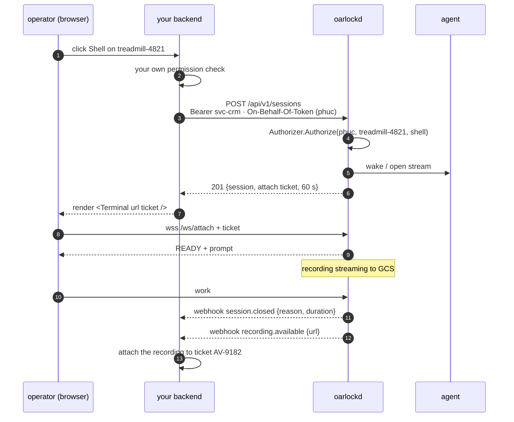

# Integrating with Oarlock

Most people will not run Oarlock as a product. They will bolt a shell onto something they
already have: an admin console, a support tool, a device-management backend. This document
is the contract for doing that.

> **Status: design phase.** Nothing here is implemented. Package names and paths are
> proposals, and the `v0` wire protocol underneath is unstable.

---

## 1. Four surfaces, not one SDK

"Integrate" means four different things depending on which side of the session you are on,
and they have almost nothing in common.

| surface | who uses it | what it is |
|---|---|---|
| **Control API** | your backend | HTTP + JSON. Open a session, list, kill, fetch a recording. Where most integrations start and stop. |
| **Terminal embed** | your web app | `@oarlock/terminal` — a terminal you drop into a page you already have. |
| **Agent library** | your device app | A library, not a binary. The device side is usually an existing app, not a new process. |
| **Events out** | your bus | Signed webhooks, or the `AuditSink` plugin if you are compiling your own gateway. |

A fifth option exists and is easy to miss: **run the gateway inside your own service** (§5).
If you are already a Go backend, that removes a deployment rather than adding one.

## 2. The control API is the contract

`/api/v1`, JSON over HTTPS. An OpenAPI 3.1 document is served at
`/api/v1/openapi.json` and is generated from the handlers, not written beside them — a
spec that drifts from the code is worse than no spec, because people trust it.

| method | path | does |
|---|---|---|
| `POST` | `/api/v1/sessions` | Open a session. Returns the session and a single-use attach ticket. |
| `GET` | `/api/v1/sessions` | List. Filter by `device_id`, `principal`, `state`, `live`. Cursor-paginated: the next cursor is in the body *and* in `Oarlock-Next-Cursor`, so a caller can page without parsing. |
| `GET` | `/api/v1/sessions/{id}` | One session, including live byte counts. |
| `DELETE` | `/api/v1/sessions/{id}` | Kill it. `close_reason` becomes `admin_kill`. |
| `POST` | `/api/v1/sessions/{id}/attach` | Mint a fresh attach ticket — for a reconnecting browser, or a second viewer. |
| `POST` | `/api/v1/devices/{id}/exec` | Run one allow-listed command, wait, return stdout, stderr and exit code. No terminal, no attach, no ticket. Creates its own session row. |
| `GET` | `/api/v1/devices` | What the gateway knows. Connection state, mode, capabilities. |
| `GET` | `/api/v1/devices/{id}` | One device. |
| `GET` | `/api/v1/recordings/{session_id}` | The asciicast, or a redirect to a signed URL. |
| `GET` | `/api/v1/recordings/{session_id}/meta` | The sidecar: exit code, close reason, durations, byte counts. |
| `POST` | `/api/v1/sessions/{id}/attach` | A fresh attach ticket for a session that is already open. |
| `POST` | `/api/v1/sessions/{id}/observe` | A ticket for watching a live session read-only. |
| `GET` | `/api/v1/events` | Server-sent events. The pull alternative to webhooks. |
| `GET` | `/healthz`, `/readyz`, `/metrics` | Unversioned, and outside the API's compatibility promise. |

**`POST /sessions` is the one that matters.** Everything else is bookkeeping.

```http
POST /api/v1/sessions
Authorization: Bearer svc_…
On-Behalf-Of-Token: eyJhbGciOi…
On-Behalf-Of: phuc@example.com
Idempotency-Key: 01J8Z6QK4M7N2P
Content-Type: application/json

{ "device_id": "treadmill-4821",
  "profile": "shell",
  "pty": { "cols": 132, "rows": 38, "term": "xterm-256color" },
  "reason": "ticket AV-9182: display frozen after firmware update",
  "limits": { "max_duration": "30m" } }
```

```json
201 Created
{ "session": { "id": "sess_01J8Z…", "state": "waking", "device_id": "treadmill-4821",
               "principal": "phuc@example.com", "opened_by": "svc-crm",
               "recording": true, "mode": "gateway", "created_at": "2026-08-20T09:14:02Z" },
  "attach": { "ticket": "hK3…", "url": "wss://gw.example.org/ws/attach",
              "expires_at": "2026-08-20T09:15:02Z" } }
```

Three fields worth arguing about:

- **`reason` is required by default** (`api.require_reason: true`). A free-text note costs
  the caller nothing and turns the session list from a log into an explanation. Set it
  false if your own system already records the why.
- **`limits` may only tighten.** A caller cannot raise a ceiling the gateway operator set.
- **`Idempotency-Key`** is honoured for 24 h. Retrying a `POST` that already opened a
  session returns *that* session rather than opening a second one — which matters because
  `sessions_per_device` defaults to 1, so a naive retry would otherwise fail with a
  concurrency error that looks like a real conflict.

### Renewing an attach ticket

```http
POST /api/v1/sessions/sess_01J8Z…/attach
Authorization: Bearer svc_…
```
```json
201 Created
{ "ticket": "9pQ…", "url": "wss://gw.example.org/ws/attach",
  "expires_at": "2026-08-20T09:16:04Z" }
```

The ticket from `POST /sessions` is single-use and lives 60 s, which means the ordinary
things a browser does — reloading the page, losing the WebSocket handshake to a flaky
network, sitting on the response for a minute — leave an operator holding a live session
and a dead credential. Renewal is what keeps single-use survivable; without it the only
recourse is a second session on the same device, which `sessions_per_device: 1` then
refuses.

It is not a loosening of the rules. The new ticket is scoped and short-lived exactly like
the first, **minting it revokes the one it replaces** (so three reloads leave one live
credential, not three), and the renewal is a fresh authenticated request — which makes it
the moment authorisation is re-checked, for free, against a principal who may have been
revoked since the session opened.

Only the principal the session belongs to may renew it. A session that has ended answers
`409 session_closed`; somebody else's session and a session that never existed both
answer `404`, so an authenticated caller cannot discover live sessions by trying ids.

**Rate limits** are per principal, per minute, reported on every response:
`Oarlock-RateLimit-Limit`, `-Remaining`, `-Reset` (seconds until the window rolls).
A `429` carries `Retry-After` pointing at the window boundary rather than a guess, so
a well-behaved client stops for exactly as long as it needs to. Unauthenticated
callers are limited by address, because otherwise the limit only protects callers who
already have credentials.

**`DELETE /sessions/{id}` is idempotent.** The caller's intent is "this must not be
running", and that is satisfied by a session that has already ended — so deleting a
closed session succeeds. Returning an error there would make a retry after a timeout
look like a failure. A session that is live in the ledger but not on the node you
asked returns **409 `wrong_node`**: a 404 would be a lie, and a 500 would suggest the
gateway is broken.

### 2.1 Errors

RFC 9457 `application/problem+json`, with the machine-readable code from
[protocol § 6](protocol.md#6-error-codes) so one vocabulary covers both the wire and the API:

```json
409 Conflict
{ "type": "https://oarlock.dev/errors/session_limit",
  "title": "Device already has a live session",
  "status": 409, "code": "session_limit",
  "detail": "treadmill-4821 has 1 of 1 allowed sessions",
  "instance": "req_01J8Z…", "retryable": true,
  "meta": { "existing_session_id": "sess_01J8Y…" } }
```

`instance` is the correlation id and appears in the gateway's logs, the audit event, and
every SDK error. It is the one string to quote in a bug report.

### 2.2 Long-poll, don't poll

A session opens asynchronously — `waking` while the doorbell rings, `opening` while the
agent dials. `GET /sessions/{id}?wait=30s` blocks until the state changes or the timeout
expires. Polling every 200 ms to watch a state machine that moves twice is a waste on both
ends, and the SDKs use the long-poll form.

## 3. Service authentication, and who the session belongs to

A service authenticates with a token (`Authorization: Bearer`), OIDC client credentials, or
mTLS — `Authenticator.AuthHTTP` decides, same interface as everything else.

Then it must answer a second question, and this is the part integrations get wrong:
**on whose behalf?**

```
Authorization: Bearer svc_…          ← which service is calling
On-Behalf-Of-Token: eyJhbGciOi…      ← proof of who is at the keyboard  (authoritative)
On-Behalf-Of: phuc@example.com       ← the same subject, for logs; must match, or 400
```

**The proof is not optional, and a bare identifier is not proof.** A plain
`On-Behalf-Of: someone@example.com` would let any holder of any service token act as any
human — including one with broader grants than the caller has. That is privilege
escalation in the one place this design claims attribution as its reason to exist. So
`Authenticator.AuthDelegated` verifies a signed assertion, in one of two shapes:

| shape | when | what Oarlock checks |
|---|---|---|
| **Subject token** (preferred) | your users log in through an IdP you can get a token from | signature, `exp`, audience, and that `sub` is the subject. The human's own credential travels with the request. |
| **Service-signed assertion** | your users hold opaque server-side sessions and there is no user token to forward | signature against the service's registered key, `exp` under 60 s, plus **`may_act_for`** — an explicit allow-list of subjects or groups this service may act for. |

The fallback is weaker and it is honest about being weaker: a compromised service can act
for anyone on its allow-list. Keep the list narrow, keep the assertion lifetime short, and
prefer the subject token wherever an IdP makes one available.

`api.allow_unattended` is the only way to open a session with no subject at all, and those
sessions are tagged (§3.1).

- `Authorizer` is called with the **human** principal. A service account cannot hold shell
  grants of its own; it can only pass through a human who has them.
- The recording and session row attribute the human. `opened_by` records the service
  separately, so both are visible and neither is lost.
- The audit event carries both, always.

**Why this is not optional.** A fleet of sessions attributed to `svc-crm` is an audit trail
nobody can use: the recording shows someone typing `rm -rf`, and the only name attached is
a robot's. The whole value of terminating SSH at the gateway is knowing who did it.

### 3.1 Sessions with no human

A service may be allowed to act without one — a scheduled diagnostic, say. That needs an
explicit `api.allow_unattended` grant, the service account must hold the action grant in
its own right, and the session is tagged `unattended: true` so it can be excluded from
"who touched this device" queries. Robots and people should never be summed into one
number, and an unattended session is the only case where a service account's own grants
are what authorise a session.

## 4. Server SDKs

Go is hand-written and first-class. TypeScript and Python are generated from the OpenAPI
document with a thin hand-written ergonomic layer on top — the generated client is correct
but reads like a generated client, and the layer above it is what people actually import.

Everything else — Ruby, Java, C#, Rust — is a generator invocation away, published only if
somebody asks. Five half-maintained SDKs are worse than two good ones and a spec.

```go
import "github.com/oarlock/oarlock-go"

c, err := oarlock.New("https://gw.example.org", oarlock.WithToken(os.Getenv("OARLOCK_TOKEN")))

s, err := c.Sessions.Open(ctx, oarlock.OpenRequest{
    DeviceID: "treadmill-4821",
    Profile:  oarlock.ProfileShell,
    // the subject's own token, forwarded — not a bare email
    ActingFor: oarlock.SubjectToken(user.IDToken),
    Reason:    "ticket AV-9182",
})
if err != nil {
    var e *oarlock.Error
    if errors.As(err, &e) && e.Code == oarlock.ErrDeviceOffline {
        return fmt.Errorf("device is not connected: %w", err)
    }
    return err
}

// hand s.Attach.Ticket to the browser; it is single-use and expires in 60 s
```

```ts
import { Oarlock } from "@oarlock/sdk";

const oarlock = new Oarlock({ baseUrl: "https://gw.example.org", token: process.env.OARLOCK_TOKEN });

const { session, attach } = await oarlock.sessions.open({
  deviceId: "treadmill-4821",
  profile: "shell",
  actingFor: { subjectToken: user.idToken },   // or { assertion } if you sign your own
  reason: `ticket ${ticket.id}`,
});
```

```python
from oarlock import Oarlock

oarlock = Oarlock(base_url="https://gw.example.org", token=os.environ["OARLOCK_TOKEN"])

out = oarlock.devices.exec(
    device_id="treadmill-4821",
    argv=["logcat", "-d", "-t", "500"],
    acting_for=SubjectToken(user.id_token),
    reason="triage",
)
print(out.stdout, out.exit_code)
```

Every SDK does the same four unglamorous things, because they are what a hand-rolled HTTP
client always skips: retry with jittered backoff on `retryable` errors only, send an
`Idempotency-Key` on every `POST` automatically, use the long-poll form when you await a
state, and surface `instance` on every error.

**`exec` is the endpoint most integrations should reach for first.** Most of what wants a
shell wants one command and its output. It needs no terminal, no WebSocket, no ticket, and
no human — and an allow-listed argv is a much smaller thing to review than a shell.

## 5. Running the gateway inside your service

If your backend is already Go, the gateway can be a library rather than a deployment. It
mounts on a mux you already have and reuses the auth you already wrote.

```go
gw, err := oarlock.NewGateway(oarlock.Config{
    Authenticator: myAuth,       // your existing session cookies and service tokens
    Authorizer:    myPerms,      // your existing permission checks
    Recorder:      gcsRecorder,
    SessionStore:  pgStore,
})

mux.Handle("/oarlock/", gw.HTTPHandler())   // /ws/control, /ws/session, /ws/attach, /api/v1
go gw.RunSSH(ctx, ":2222")                  // optional; skip it for browser-only
go gw.Run(ctx)
```

You get one binary, one deployment, one identity system, and no service-to-service auth to
configure. What you give up is the isolation: **the gateway reads every keystroke in every
session** ([threat model § 4](threat-model.md#4-gateway-compromise-is-total)), so embedding
it means your application process now carries that capability. A bug in an unrelated
handler is a bug in something that can open a shell on any device you manage.

Embed it for a small deployment or an internal tool. Keep it separate when the blast radius
of your main application is already something you worry about.

## 6. Embedding the terminal

```
npm i @oarlock/terminal        # framework-agnostic core, bundles xterm.js
npm i @oarlock/react           # <Terminal /> wrapper
```

```tsx
import { Terminal } from "@oarlock/react";
import "@oarlock/terminal/oarlock.css";

<Terminal
  url={attach.url}
  ticket={attach.ticket}
  device="treadmill-4821"
  principal="phuc@example.com"
  renewTicket={() => api.renewAttach(session.id)}   // POST /sessions/{id}/attach
  onState={(s) => setState(s)}          // connecting | attached | reconnecting | closed
  onClosed={(reason) => showSummary(reason)}
  onError={(e) => report(e.code)}       // the same codes as everywhere else
  theme="inherit"
/>
```

Without React:

```ts
import { mount } from "@oarlock/terminal";
import "@oarlock/terminal/oarlock.css";

const handle = mount(document.getElementById("shell")!, { url, ticket, device, principal });
handle.dispose();
```

Design rules the package enforces rather than documents:

- **The browser never holds a long-lived credential.** It gets a single-use attach ticket
  from *your* backend, which is where authorisation was checked. When a ticket is refused
  at open time the component calls `renewTicket` once and re-dials — so the retry goes
  through your backend and re-checks authorisation, rather than resuming on the strength
  of an old decision. A second refusal is reported, not retried: a renewal loop against a
  gateway that refuses everything is a denial of service you would be running on
  yourself.
- **An unrecorded session will not render without an acknowledgement.** `<Terminal>`
  shows its own blocking gate when `READY` says the session is unrecorded or in
  passthrough, and there is no terminal behind the gate while it is up — a gate over a
  live terminal is decoration. The single way past it is
  `acknowledgeUnrecordedWithoutPrompt`, named for its consequence so that reaching for it
  is a decision. Device output that arrives during the gate is held and replayed
  afterwards rather than shown or dropped.
- **A dropped connection is not a failure, and is not reported as one.** The gateway
  keeps the session attached when a browser drops and holds what the device produced in a
  ring, so the component reconnects rather than surfacing an error: the bar says
  *Reconnecting*, the screen dims, and on return the scrollback replays. It fetches a
  fresh ticket through `renewTicket` for each attempt, backs off with jitter — a gateway
  that just dropped every operator gets them all back at once otherwise — and gives up
  after `maxReconnects` (6) rather than leaving somebody staring at *Reconnecting* for a
  session that is not coming back. A `CLOSE` from the gateway is a decision, not an
  accident, and is never reconnected through.
- **Keystrokes typed while disconnected are dropped, not queued.** This is a deliberate
  departure from what a text field would do. A terminal interprets bytes in context, so
  input replayed eight seconds later can land somewhere that has moved on — a pager that
  exited, a confirmation prompt that is now a different question. Losing the characters is
  visible; delivering them somewhere unintended is not.
- **A missing field is not a promise.** A `READY` with no `recording` — an older gateway,
  a proxy that dropped it, a mock that forgot it — counts as unrecorded. Falling the other
  way would make a missing byte indistinguishable from a guarantee.
- **The status bar is not a prop.** It states the four facts (which device, recorded or
  not, who else is watching, connection state) and has no dismissal affordance. Build your
  own chrome if you want to — `<StatusBar>` and `<PreflightGate>` are exported for exactly
  that — but the core still refuses to hand you a terminal for an unacknowledged
  unrecorded session, so composing your own layout cannot lose the disclosure.
- **The failure states are typed events, not strings, and every one has a screen.** A UI
  must be able to tell "you don't have access" from "we could not check your access"
  without parsing prose, because they send someone to different places. The closed set
  lives in `pkg/condition` and is generated into the package as `@oarlock/terminal/conditions`,
  so `<Terminal>` renders a screen per condition and a code the gateway can emit cannot be
  one the component has never heard of. An unknown code — a gateway newer than your build
  — renders as "we don't recognise this", never as a blank pane. `<FailureScreen>` is
  exported if you want to place it yourself.
- **A watcher's input is disabled, not ignored.** `read_only` in `READY` makes the
  component set the terminal read-only — `readonly`, not `disabled`, so somebody using a
  screen reader can still read the session they came to watch — and the status bar leads
  with `READ-ONLY · watching <operator>`. The prop of the same name can only *add* the
  restriction: a host can voluntarily disable its own input, and can never make a
  read-only connection writable.
- **The operator being watched is told, by name.** The bar carries a persistent
  `OBSERVED by …` indicator for as long as it is true, inside an `aria-live` region so it
  is announced rather than only drawn. Anonymous observation is not offered at any level.
- **A retry is offered only where retrying could work.** The table says which conditions
  are retryable, so a withdrawn grant does not get a button that invites somebody to keep
  pressing it at a decision that will not change.
- **OSC 52 clipboard writes and title reporting are off**, and off by our own handler
  rather than by upstream's default — the risk being a default that changes under a
  dependency bump. A compromised device cannot write to the operator's clipboard, read it
  back, set the window title, or ask for the window's size or position. Opt in per
  instance with `allowDeviceClipboardWrites` / `allowDeviceTitleChanges` if you trust your
  fleet.
- **`theme="inherit"`** reads your CSS custom properties instead of shipping a palette
  that fights your app. Every rule we write is scoped under one `.oarlock-term` class and
  every property is namespaced `--oarlock-*`; xterm's own stylesheet arrives under its
  `.xterm*` namespace. Nothing we ship is a bare element selector, and mounting does not
  touch your `<body>`.

## 6.1 Replay

```tsx
import { Player } from "@oarlock/react";
import "@oarlock/terminal/player.css";   // replay only; not needed for a live terminal

<Player cast={cast} verdict={verdict} sessionID={session.id} />
```

**The integrity verdict is not a prop.** `<Player>` renders it above the recording, in the
document as well as visually, and there is no option that removes it. A player that shows a
tampered recording exactly like an intact one is a player that launders it — and the hash
chain and the signed manifest exist precisely so that somebody reading a session afterwards
can tell the difference.

You supply the verdict; the component does not compute one. Verification needs the manifest
and a public key your *deployment* trusts, which is not a decision a browser can make for
itself. What the component guarantees is that the answer is shown — including when the
answer is "you did not give me one", which renders as **unverified** rather than as fine.

The five outcomes are separate screens on purpose, because they send somebody to different
places:

| verdict | what it means | how it reads |
|---|---|---|
| `valid` | the chain reaches the signed head with the expected count | intact |
| `truncated` | everything present is intact and the file stops early | *incomplete*, with how much verifies — usually a process that died, not tampering |
| `altered` | the contents do not match what was signed | tampering |
| `bad_signature` | the manifest is not signed by the expected key | possibly another deployment's recording; not an accusation |
| `malformed` | not a readable asciicast | nothing to verify and nothing to play |

An unrecognised verdict withholds the claim of integrity rather than implying it: a
verifier newer than your build is a reason not to vouch for a recording.

`player.css` is a separate import from `oarlock.css` deliberately — asciinema-player ships
around 120 global rules, and embedding a live terminal should not drag them in.

## 7. Embedding the agent

**A library, not a binary — and that is a platform constraint, not a preference.** Android
10 forbids executing a binary from app storage, so on the platform this was designed for
the agent *must* live inside an existing APK. Everywhere else, in-process means one thing
to supervise instead of two.

```go
import "github.com/oarlock/oarlock-go/agent"

a := agent.New(agent.Config{
    Gateway:  "wss://gw.example.org/ws/control",
    DeviceID: deviceID,
    Signer:   hardwareKeySigner,          // never a key on disk if the platform offers better
    PinSHA256: []string{"sha256/AbCd…"},

    Shell: agent.ShellFunc(func(ctx context.Context, r agent.ShellRequest) (agent.PTY, error) {
        return agent.Forkpty(ctx, "/system/bin/sh", agent.WithEnv("TERM", r.Term))
    }),
    ExecAllowlist: []agent.ExecEntry{
        {Name: "logcat", Argv: []string{"logcat", "-d"}, MaxArgs: 4},
        {Name: "df",     Argv: []string{"df", "-h"}},
    },
    FileRoot:     "/data/oarlock/share",
    TCPAllowlist: nil,                     // empty by default, and usually correct

    OnSession: func(ev agent.SessionEvent) { log.Printf("shell %s by %s", ev.SessionID, ev.Principal) },
})
go a.Run(ctx)
```

- **`Shell` is a hook because "a shell" is platform-specific.** Which binary, which
  environment, which uid, whether a PTY is available at all. A device that cannot provide
  one omits the capability, and the gateway then refuses the session at open time with a
  real reason instead of after a round trip.
- **`OnSession` is for your logs, not for a decision.** The agent trusts the gateway
  completely and cannot verify a principal. Do not gate on it.
- **Kotlin binding** (`oarlock-android`) wraps the same core as a `Service` with a
  foreground notification, because that is what Android requires of a process holding a
  socket.
- **Any other language:** the wire protocol is public and the frame codec is 200 lines.
  [docs/protocol.md](protocol.md) is the whole contract; `pkg/frame` is the reference, not
  a requirement.

## 8. Events out

Webhooks for anyone; the `AuditSink` plugin if you are compiling your own gateway.

| event | fires when |
|---|---|
| `session.opened` | both ends paired, first byte imminent |
| `session.closed` | with `close_reason`, exit code, byte counts, duration |
| `session.revoked` | a grant was withdrawn mid-session |
| `recording.available` | finalised and readable — the one to trigger retention or review on |
| `device.connected` / `device.disconnected` | `persistent` mode only |
| `authz.denied` | someone was refused. Worth alerting on in volume. |

```http
POST /your/webhook
Oarlock-Signature: t=1787218725,v1=5c3a…
Oarlock-Event: session.closed
Oarlock-Delivery: dlv_01J8Z…
```

HMAC-SHA256 over `t.body` with a shared secret; reject anything older than 5 minutes.
**Delivery is at-least-once, so consumers must be idempotent** — `Oarlock-Delivery` is
stable across retries and is what you dedupe on. Failed deliveries retry with backoff for
an hour, then land in a dead-letter list you can read from the API.

Webhooks are for reacting, not for state. If you need to know what is live right now, ask
`GET /sessions` — an event stream you replay to derive current state will be wrong exactly
once, on the delivery you missed.

## 9. What is stable, and what is not

| | promise |
|---|---|
| `/api/v1` | Additive changes only. New optional fields and new endpoints, never a changed meaning. A `v2` would run beside `v1`, not replace it. |
| SDK majors | Semver. A breaking change is a major, and the previous major gets six months. |
| `pkg/frame`, `pkg/plugin` | Public Go API, semver, deprecation before removal. |
| The wire protocol | **`v0`, unstable.** It will change. Anything speaking it should pin a commit until there is a `v1`. |
| `internal/…` | No promise at all. Do not import it; that is what `internal` means. |
| `/metrics`, `/healthz` | Operational surface, not API. Names may change between minors. |

Agents are the slow half of any fleet — some device will be a year behind because it was in
a box — so the gateway supports one wire version back, and the API supports the previous
major. Both of those are the *gateway's* problem by design, because it is the side that can
be upgraded on purpose.

## 10. A whole integration, end to end

An existing admin console adds a **Shell** button. Nothing else about it changes.



What your backend actually wrote: one HTTP call, one component, two webhook handlers. What
it did not write: a tunnel, a PTY, a recorder, a ticket scheme, a reconnect path, or a
terminal emulator.

What lands in the audit trail: `phuc@example.com` opened a shell on `treadmill-4821`
via `svc-crm`, for ticket AV-9182, for four minutes, and here is the recording.
