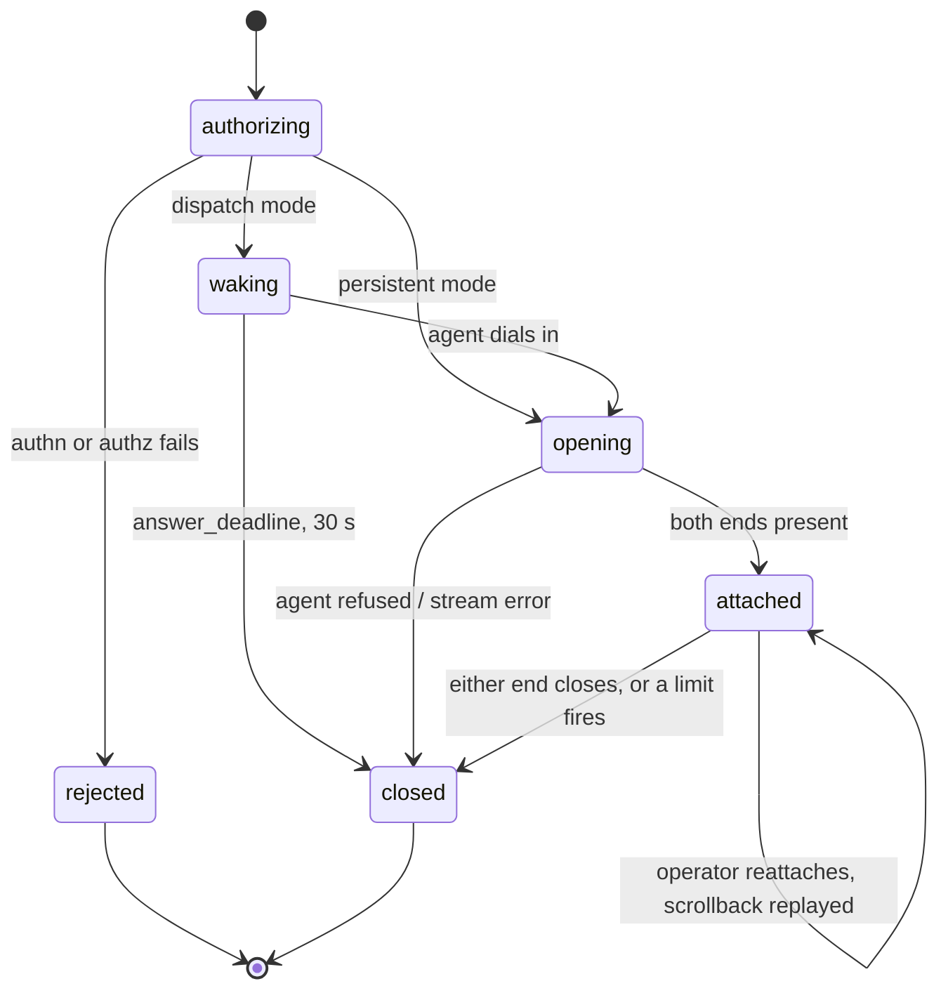

A dropped **operator** socket is not a close. The session stays `attached`, the ring
buffer keeps filling, and a reconnecting operator gets the scrollback replayed. Operators
lose wifi constantly; a shell that dies with it is a shell nobody trusts with a long
command.

`close_reason` is a closed set, and it is the single source of truth for what the UI says:

| reason | fired by |
|---|---|
| `operator_close` | operator disconnected cleanly, or the remote command exited |
| `device_close` | the PTY exited or the agent shut down |
| `idle_timeout` | no operator input for `limits.idle` |
| `max_duration` | `limits.max_duration` reached |
| `admin_kill` | `DELETE /api/sessions/\{id\}` |
| `revoked` | `Authorizer` withdrew the grant mid-session (§7) |
| `authz_unavailable` | `Authorizer` could not be reached for `authz.grace` consecutive re-checks (§7.1) |
| `recorder_failed` | the recording could not be written and the spool ran out (§8.1) |
| `device_offline` | agent never answered the doorbell |
| `transport_error` | either socket failed |
| `gateway_shutdown` | drain on SIGTERM |
| `policy_denied` | passthrough requested where policy forbids it |
| `policy_conflict` | two `record_input` rules disagree and one is non-overridable (§ 8.2) |
