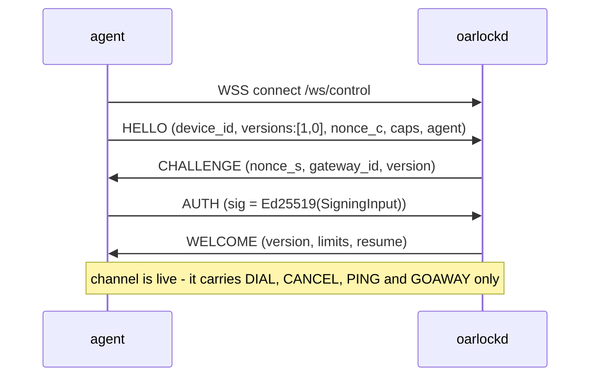

Three, and they divide along the two connection kinds.

<a id="30-checking-your-implementation"></a>
### 3.0 Checking your implementation

`pkg/agentconf` is an executable version of this document, and `cmd/oarlock-conformance`
runs it:

```
oarlock-conformance -device rower-1 -key rower-1.pub
  control channel: ws://127.0.0.1:9440/ws/control
```

Point your agent at that URL and it reports which paragraphs below your implementation
honours. Each case is one control channel — the suite hangs up between them and expects
you to reconnect, which makes "you come back after the gateway drops you" the first thing
it checks.

Two things it deliberately does not claim. Serve it over `ws://` and the channel-binding
cases are **skipped rather than passed**, because there is no channel to bind to; pass
`-cert` to check them. And four properties are invisible from the wire — whether your
private key stayed on the device, whether you pinned the certificate, whether your
allow-lists are enforced, and the per-profile behaviour of a live session — so the report
lists them as unchecked on every run rather than letting a green result imply them.

<a id="31-control-channel--device-key-challengeresponse"></a>
### 3.1 Control channel — device key, challenge–response

A `persistent`-mode agent holds one control channel, so it needs a long-lived
identity. It gets an Ed25519 key pair generated on the device at first boot; the
public half is registered out of band by whatever does enrollment. **The private key
never leaves the device and is never sent** — a bearer token would be replayable by
anything that read a log.



The signed bytes are **length-prefixed and domain-separated**, not concatenated. There
are two versions, and the version *is* the domain separator:

```
v1 (channel-bound)                      v0 (unbound)
"oarlock-control-v1" 0x00               "oarlock-control-v0" 0x00
  u16(len) nonce_s   u16(len) nonce_c     u16(len) nonce_s   u16(len) nonce_c
  u16(len) device_id u16(len) gateway_id  u16(len) device_id u16(len) gateway_id
  u16(len) channel_binding
```

`channel_binding` is 32 bytes of RFC 5705 exported keying material, label
`EXPORTER-oarlock-control-v1`, taken from the TLS connection the handshake is running on.
**It never appears on the wire** — both sides compute it independently and only mix it into
what is signed.

Making the version the domain separator rather than a field inside the input is what makes
cross-version replay impossible by construction: a v0 signature cannot verify as a v1 one
whatever else matches.

An earlier draft of this document described plain concatenation, and that was a
vulnerability rather than a simplification: device `ab` with gateway `c` produces
the same bytes as device `a` with gateway `bc`, so a peer that controls one field
can shift the boundary and obtain a signature that validates against values nobody
agreed to. Length prefixes make the encoding injective. The domain string means a
device key's signature can never be valid in some other protocol that happens to
hash similar bytes.

- Both nonces are 32 random bytes, base64url. Both sides contribute, so neither can
  pin the signed value.
- **A failed handshake always reports `auth_failed`**, whether the device is
  unknown, the signature is wrong, or the key was retired — and the exchange does
  not short-circuit, so an unknown device still receives a `CHALLENGE`. The
  protocol has a `device_unknown` code; sending it to an unauthenticated peer would
  hand it an enumeration oracle for the fleet. The specific reason is logged.
- Every registered key is tried, which is what makes rotation work: publish the new
  key alongside the old, let devices roll over, then retire the old one.
- The gateway id is in the signed blob so a signature captured by one gateway cannot
  be replayed to another.
- **Channel binding (v1) is what stops a relay.** A TLS-terminating middlebox has two
  TLS sessions and therefore exports two different keying materials: the device signs over
  one and the gateway verifies over the other, so the signature does not verify. The
  middlebox does not have to modify a single frame for this to catch it.

  Certificate pinning was the stopgap and covers less than it looks: it only stops a
  middlebox that has to present a certificate the device would *reject*. An inspection
  appliance whose CA is in the device's trust store passes pinning and then holds the
  device's authenticated channel.

- **The version is chosen by the gateway, so downgrade is a policy question on both
  sides.** `CHALLENGE` carries the chosen version precisely because the agent has to know
  it before it signs — an agent that learned it from `WELCOME` would already have signed
  the wrong thing. The agent checks it against what it offered.

  Beyond that, nothing cryptographic can stop a downgrade: a v0 handshake genuinely has
  nothing to bind with, so refusing one is a decision rather than a verification. Both
  ends therefore carry an explicit `require_channel_binding`, and an agent that sets it
  does not offer v0 at all. **Both default to off**, because requiring binding means
  refusing to connect to a gateway that cannot provide one — and a fleet in the field that
  will not reconnect needs somebody to drive to it. Binding is used wherever both ends
  can; it is *required* only where somebody has said so. `internal/safety` refuses
  production without it on the gateway.

  Exporting also fails on a TLS 1.2 session resumed without extended master secret, where
  the exporter would not be tied to this handshake. Go refuses rather than returning
  something that looks bound and is not, and a gateway that requires binding reports that
  as a refusal rather than downgrading.
- The whole exchange has a 5 s budget from socket open. `AgentAuthenticator` may
  replace it entirely — mTLS moves the problem into the TLS layer and skips § 3.1.
- `WELCOME.resume` names sessions the gateway is still holding for this device. The
  agent dials back for each one, which is how a shell survives a device losing its
  radio.

<a id="32-session-connection--one-time-ticket"></a>
### 3.2 Session connection — one-time ticket

Every session, in **both** reachability modes, is its own connection opened with a
ticket:

```
agent ──▶ WSS connect  /ws/session
agent ──▶ OPEN {ticket, device_id, profile, pty, agent}
gw    ──▶ READY {session_id, scrollback_len, recording, mode}   … or ERROR and close
```

The only difference between the modes is **how the agent learned to dial**:

| mode | the invitation arrives as |
|---|---|
| `persistent` | a `DIAL` frame down the control channel (§ 4.13) |
| `dispatch` | the identical payload, delivered by a `Dispatcher` over MQTT, a webhook, or an exec |

Both carry the same `Invitation`: session id, ticket, the URL of the **specific
gateway node** to dial, profile, pty, principal and an expiry. Downstream of arrival
there is one code path — which is the whole return on not multiplexing.

Redeeming a ticket is an atomic compare-and-delete; a replay finds nothing. A
retried dial must **fetch a new invitation, never resend a spent ticket.** An agent
that retries a spent ticket looks exactly like an attacker replaying one, and the
gateway cannot tell the difference, so it treats both as an attack.

<a id="33-browser-leg"></a>
### 3.3 Browser leg

```
browser ──▶ WSS connect  /ws/attach
browser ──▶ OPEN {ticket}
gw      ──▶ READY {session_id, scrollback_len} + DATA (scrollback replay)
```

Structurally identical to § 3.2 — a session connection authenticated by a ticket.
The attach ticket comes from `POST /api/v1/sessions`. It is single-use, so a
reconnecting browser asks for a fresh one, which is also the moment authorisation is
re-checked for free.

**A second connection for a live session is a reattach, not a new session.** If the
session named by the ticket is already running on this node, the gateway does not look
for a device — the device is already paired and pumping. It hands the connection to the
running session instead, and `READY` is followed immediately by the scrollback:

```
browser ──▶ WSS connect  /ws/attach
browser ──▶ OPEN {ticket}          ← a *fresh* ticket; the last one was spent
gw      ──▶ READY {session_id, scrollback_len: 12043, recording, mode}
gw      ──▶ DATA  (the scrollback, then the live stream)
```

`scrollback_len` is exactly what follows, so a browser can say "replaying 12 KiB" rather
than looking frozen. The greeting and the replay are written under the same lock as live
output, so a `DATA` frame produced a microsecond after the reattach cannot overtake the
scrollback and assemble the screen in the wrong order.

Two refusals are worth telling apart. A session that already has an operator answers
`session_limit`: two operators writing into one shell would interleave their keystrokes,
and watching one is a different feature. A session that cannot be reattached to at all —
every SSH session — answers `protocol_error`, because a second `ssh` invocation is a new
session and there is nothing to come back to.

**Either end may arrive first, and the gateway waits.** This is the one way the browser
leg genuinely differs from § 3.2, and it is not a detail: over SSH a single goroutine
invites the device and then blocks, so the device has always arrived by the time
anything looks for it. `POST /api/v1/sessions` instead returns as soon as the invitation
has been *delivered*, and the browser then connects on a separate request — routinely
faster than a sleeping device can wake, dial `/ws/session`, and present its ticket. So
`/ws/attach` blocks until the device's connection is parked, bounded by the same answer
deadline the invitation carries; only reaching that deadline is `device_offline`. A
gateway that instead refused whenever the device had not arrived *yet* would report
`device_offline` for perfectly healthy sessions, intermittently, decided by which of two
round trips won.
