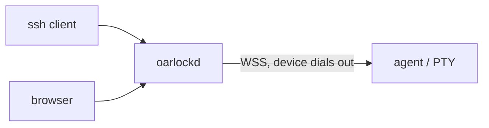

<Warning>
The gateway reads every keystroke and every byte of output, and can inject its own. That is not a gap. It is the direct cost of terminating SSH at the gateway, and it is stated here before anything else that cost makes possible.
</Warning>

A real `ssh` prompt on a device behind NAT, on a cellular APN, or on a customer's LAN — without a listener, a host key, or an open port on that device.

<Note>
Protocol **v0**, unstable. There are no releases.
</Note>

<CardGroup cols={2}>
  <Card title="Use cases" href="/use-cases">
    The problems inbound SSH cannot touch, and how a session is opened anyway.
  </Card>
  <Card title="Quickstart" href="/quickstart">
    The real flags, on one machine, until you have a shell.
  </Card>
  <Card title="Demos" href="/demos">
    Four profiles and the console, recorded against a running gateway.
  </Card>
  <Card title="Diagrams" href="/diagrams">
    Trust boundaries, port forwarding, authentication.
  </Card>
  <Card title="Threat model §12" href="/generated/threat-model/12-what-is-actually-built">
    What is implemented, what is tested, and what is only described.
  </Card>
  <Card title="Architecture" href="/generated/architecture/1-scope">
    Components, reachability, recording, and the limits each one is under.
  </Card>
</CardGroup>

## Not built

Named here so nobody has to find out later:

- **Multi-replica operation** — a device belongs to the node holding its control channel, and no other node can invite it.
- **Generated SDKs** — TypeScript and Python clients are not shipped.

SSH-CA authentication and mode A passthrough *are* built. They are not on this list.
